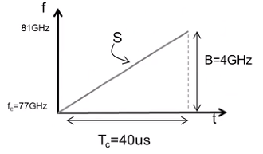
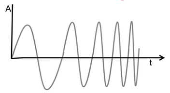
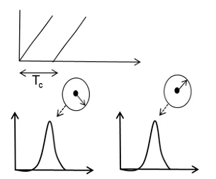
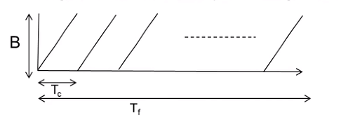
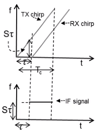
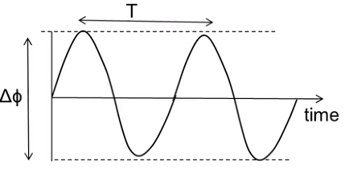
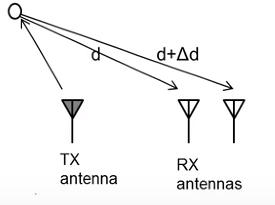
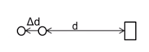
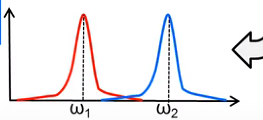
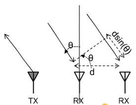

# 图片库

本页面展示网站中使用的所有技术图示和说明图。图片已托管于本仓库，无需依赖外部 CDN。

## FMCW 雷达原理

### 频率时间关系



**说明**：FMCW 信号的频率随时间线性变化，形成 Chirp 信号。

---

### 测距原理



**说明**：发射信号（蓝色）和接收信号（红色）之间的频率差即为拍频，用于计算距离。

---

### 三角波调制



**说明**：通过上扫频和下扫频可以同时测量距离和速度。

---

### Frame 结构



**说明**：一个 Frame 由多个 Chirp 组成，用于多普勒频率分析。

---

## 信号处理

### 发射接收原理



**说明**：雷达系统的基本发射和接收架构。

---

### 相位差



**说明**：不同接收天线之间的相位差，用于角度估计。

---

### 双天线系统



**说明**：双接收天线系统的相位差分析原理。

---

### 角度估计



**说明**：通过多天线阵列的相位差进行目标角度估计。

---

### 角度 FFT



**说明**：通过 FFT 在角度维度进行处理，获得目标的角度信息。

---

## 目标检测

### CFAR 分析



**说明**：CFAR 检测算法的窗口结构和噪声估计原理。

---

## 其他可用图片

以下图片来自原项目，可根据需要添加到相应章节：

### 相位分析

- [中频信号相位](images/signal-processing/phaseOfIF.png)
- [相位加延迟](images/signal-processing/phaseplustau.png)

### 灵敏度分析

- [中频灵敏度](images/signal-processing/IFsensitivity.png)
- [系统灵敏度](images/signal-processing/sensitivety.png)
- [角度灵敏度](images/signal-processing/thetasens.png)

### 角度估计

- [角度估计方法](images/signal-processing/angleestimate.png)

### Frame 配置

- [不同 Frame](images/fmcw/diffframe.png)
- [相同配置](images/fmcw/sametwo.png)

### 性能分析

- [功率分析](images/signal-processing/POWER.png)
- [结果分析](images/signal-processing/result.png)

### 问题示例

- [问题 1](images/target-detection/problem_1.png)
- [问题 2](images/target-detection/problem_2.png)
- [速度距离冲突](images/fmcw/sdconflicts.png)

---

## 使用说明

### 在文档中引用图片

```markdown
{ loading=lazy }
```

图片目录结构：

| 子目录 | 内容 |
|---|---|
| `images/fmcw/` | FMCW 原理、Frame、三角波等 |
| `images/signal-processing/` | 天线、相位差、角度 FFT、灵敏度等 |
| `images/target-detection/` | CFAR、目标检测问题示例 |

---

## 版权说明

所有图片版权归原作者 [matreshka15](https://github.com/matreshka15) 所有，来源于项目 [mmwave_radar_learning_notebook](https://github.com/matreshka15/mmwave_radar_learning_notebook)。

本网站仅用于教育和学习目的。
