# mmWave Insight

  <h2>mmWave Radar Insight | 毫米波雷达洞察</h2>
  
<strong>Deep Dive into mmWave Radar Technology</strong>

  
深入毫米波雷达技术 · 基于 TI IWR1443BOOST 平台

---

## 👋 欢迎来到 mmWave Insight

!!! info "关于本平台"
    **mmWave Insight** 是一个专业的毫米波雷达学习平台，致力于深入探索雷达原理、毫米波技术以及实际应用。本平台整合了系统的理论知识和 TI IWR1443 开发板的实践指导。

!!! tip "学习路径推荐"
    **由浅入深的学习路径：**

    1. 📚 **基础入门** → 从[雷达基础](radar-basics/overview.md)开始，理解雷达工作原理
    2. 🔬 **进阶理论** → 深入[FMCW 调制](mmwave/fmcw.md)和信号处理技术
    3. 🎮 **互动实践** → 通过[交互式游乐场](interactive-playground.md)动手体验
    4. 🛠️ **硬件开发** → 基于[IWR1443 平台](iwr1443/hardware.md)实战应用

### 📋 平台特色

!!! abstract "开发平台"
    **IWR1443BOOST**
    Texas Instruments 76-81 GHz 毫米波雷达
    集成 ARM + DSP，功能强大

!!! note "内容特点"
    **理论与实践结合**
    雷达原理课程 + 实战开发指导
    从基础到应用，循序渐进

!!! success "学习目标"
    **掌握核心技术**
    理解雷达方程、FMCW 调制
    具备毫米波雷达开发能力

## 📚 学习内容

-   :material-school:{ .lg .middle } **1️⃣ 基础入门**

    ---

    从零开始，建立雷达知识体系：

    - ✅ 雷达系统概述与工作原理
    - ✅ 雷达方程完整推导
    - ✅ 多普勒效应及速度测量
    - ✅ RCS 与目标特性分析

    [开始学习 :octicons-arrow-right-24:](radar-basics/overview.md){ .md-button .md-button--primary }

-   :material-chart-line:{ .lg .middle } **2️⃣ 进阶理论**

    ---

    深入毫米波雷达核心技术：

    - ✅ FMCW 调频连续波调制原理
    - ✅ Range-Doppler FFT 信号处理
    - ✅ DOA 角度估计算法详解
    - ✅ CFAR 目标检测技术

    [深入学习 :octicons-arrow-right-24:](mmwave/fmcw.md){ .md-button }

-   :material-gamepad-variant:{ .lg .middle } **3️⃣ 互动实践**

    ---

    通过交互式工具巩固理解：

    - 🎯 FMCW 雷达测距模拟器
    - 📐 雷达方程计算器
    - 🌊 多普勒效应模拟器
    - 📡 FFT 频谱分析工具

    [开始体验 :octicons-arrow-right-24:](interactive-playground.md){ .md-button }

-   :material-chip:{ .lg .middle } **4️⃣ 硬件开发**

    ---

    基于 TI IWR1443 的实战应用：

    - ✅ 硬件架构与性能参数
    - ✅ SDK 开发环境搭建
    - ✅ 代码示例与调试技巧
    - ✅ 实际应用案例分享

    [查看详情 :octicons-arrow-right-24:](iwr1443/hardware.md){ .md-button }

---

## 🎓 学习进度建议

```mermaid
graph LR
    A[📚 雷达基础] --> B[🔬 FMCW 原理]
    B --> C[📡 信号处理]
    C --> D[🎮 互动练习]
    D --> E[🛠️ 硬件开发]
    E --> F[🚀 实际应用]

    style A fill:#e3f2fd
    style B fill:#f3e5f5
    style C fill:#fff9c4
    style D fill:#c8e6c9
    style E fill:#ffe0b2
    style F fill:#ffcdd2
```

!!! success "学习里程碑"
    **初级目标**：理解雷达基本原理和雷达方程 ✓
    **中级目标**：掌握 FMCW 调制和 FFT 信号处理 ✓
    **高级目标**：完成 IWR1443 平台的实战开发 ✓

---

## 🚀 快速开始

-   :material-foot-print:{ .lg .middle } __第一步__

    ---

    **理解雷达如何工作**

    从[雷达原理概述](radar-basics/overview.md)开始，建立基础认知

-   :material-calculator:{ .lg .middle } __第二步__

    ---

    **学习核心公式**

    深入[雷达方程](radar-basics/radar-equation.md)，掌握计算方法

-   :material-sine-wave:{ .lg .middle } __第三步__

    ---

    **探索 FMCW 技术**

    理解[FMCW 调制](mmwave/fmcw.md)的测距测速原理

-   :material-gamepad:{ .lg .middle } __第四步__

    ---

    **动手实践**

    使用[交互式工具](interactive-playground.md)验证理论

---

## 说明

!!! note "关于本笔记"
    - 本笔记内容可能存在疏漏，欢迎指正
    - 原始 LaTeX 笔记可在 [GitHub 仓库](https://github.com/matreshka15/mmwave_radar_learning_notebook) 下载
    - 本网站基于原 LaTeX 笔记整理，方便在线阅读

## 贡献

如发现内容错误或有改进建议，欢迎：

- 在 [GitHub](https://github.com/matreshka15/mmwave_radar_learning_notebook) 提交 Issue
- 提交 Pull Request
- 与作者交流讨论

---

  
<small>💡 mmWave Insight - Illuminate Your Radar Knowledge</small>

  
<small>Built with MkDocs Material | Based on mmwave_radar_learning_notebook</small>

