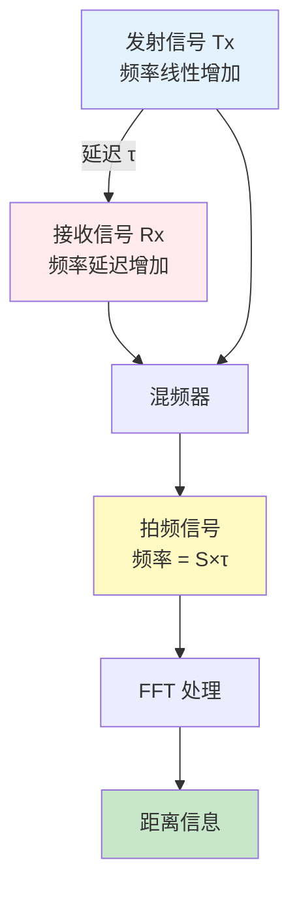
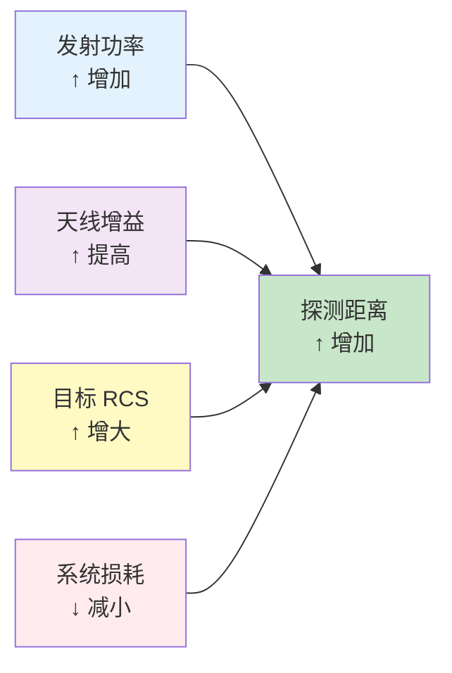
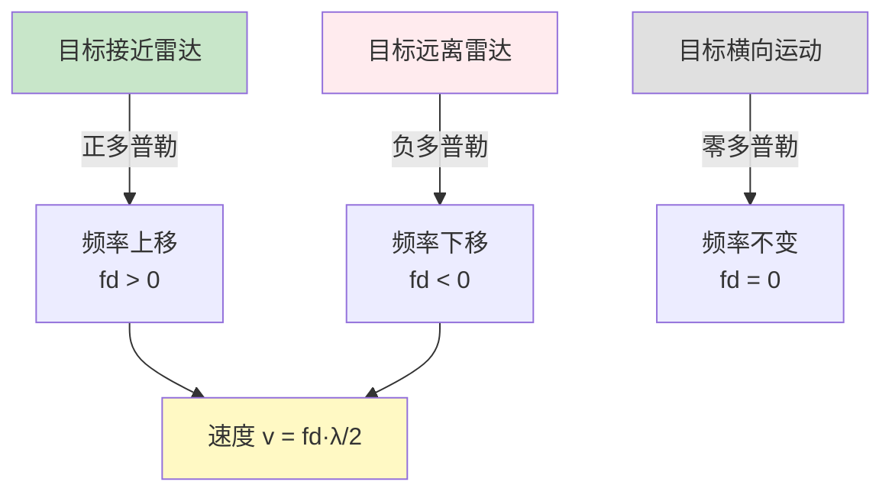
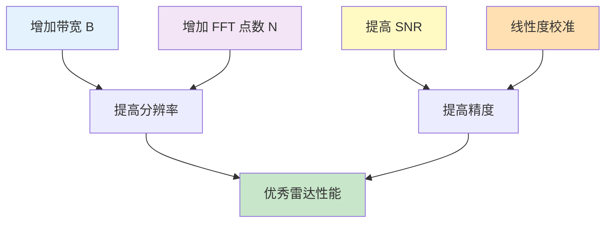

# 🎮 互动游乐场

!!! abstract "欢迎来到交互区"
    在这里，你可以通过可视化的交互式工具，直观地理解毫米波雷达的关键概念。动手调整参数，观察结果变化，让学习变得更有趣！

---

## 🎯 1. FMCW 雷达测距模拟器

!!! tip "学习目标"
    理解 FMCW 雷达的测距原理，观察 Chirp 信号和拍频的关系

### 📊 交互式参数调整

试着调整下面的参数，观察测距结果的变化：

| 参数 | 符号 | 默认值 | 调整范围 |
|------|------|--------|----------|
| 起始频率 | $f_0$ | 77 GHz | 76-81 GHz |
| 带宽 | $B$ | 4 GHz | 1-4 GHz |
| Chirp 时间 | $T_c$ | 40 μs | 20-100 μs |
| 目标距离 | $R$ | 50 m | 1-200 m |

??? example "模拟步骤"
    **步骤 1：计算斜率**

    $$
    S = \frac{B}{T_c} = \frac{4 \times 10^9}{40 \times 10^{-6}} = 10^{14} \text{ Hz/s}
    $$

    **步骤 2：计算延迟时间**

    $$
    \tau = \frac{2R}{c} = \frac{2 \times 50}{3 \times 10^8} = 3.33 \times 10^{-7} \text{ s}
    $$

    **步骤 3：计算拍频**

    $$
    f_{beat} = S \tau = 10^{14} \times 3.33 \times 10^{-7} = 33.3 \text{ kHz}
    $$

    **步骤 4：验证距离**

    $$
    R = \frac{c \cdot f_{beat}}{2S} = \frac{3 \times 10^8 \times 33.3 \times 10^3}{2 \times 10^{14}} = 50 \text{ m} \quad \checkmark
    $$

### 🎨 可视化频率-时间图

!!! question "互动练习"
    **挑战 1**：如果目标距离加倍（100 m），拍频会如何变化？
    **挑战 2**：如果带宽减半（2 GHz），距离分辨率会受到什么影响？

    ??? success "答案"
        **挑战 1**：拍频加倍，变为 66.6 kHz（因为 $f_{beat} \propto R$）
        **挑战 2**：距离分辨率变差，从 3.75 cm 变为 7.5 cm（因为 $\Delta R = \frac{c}{2B}$）

---

## 📐 2. 雷达方程计算器

!!! tip "学习目标"
    直观理解各参数对雷达性能的影响，计算实际探测距离

### 🔧 参数输入区

**系统参数**：

| 参数 | 数值 | 单位 | 说明 |
|------|------|------|------|
| 发射功率 $P_t$ | 10 | mW | 典型值 10-100 mW |
| 天线增益 $G_t$ | 20 | dBi | 高增益定向天线 |
| 接收增益 $G_r$ | 20 | dBi | 与发射天线相同 |
| 工作频率 $f$ | 77 | GHz | 汽车雷达频段 |
| 目标 RCS $\sigma$ | 10 | m² | 轿车典型值 |
| 系统损耗 $L$ | 6 | dB | 包含各种损耗 |

**环境参数**：

| 参数 | 数值 | 说明 |
|------|------|------|
| 距离 $R$ | 100 | 测试距离（m）|
| 接收灵敏度 | -100 | 最小可检测功率（dBm）|

??? example "计算过程"
    **应用雷达方程**：

    $$
    P_r = \frac{P_t G_t G_r \lambda^2 \sigma}{(4\pi)^3 R^4 L}
    $$

    **代入数值**：

    - 波长：$\lambda = \frac{c}{f} = \frac{3 \times 10^8}{77 \times 10^9} = 3.9$ mm
    - 线性增益：$G_t = G_r = 10^{20/10} = 100$
    - 线性损耗：$L = 10^{6/10} = 4$

    $$
    P_r = \frac{0.01 \times 100 \times 100 \times (0.0039)^2 \times 10}{(4\pi)^3 \times (100)^4 \times 4}
    $$

    $$
    P_r \approx 2.4 \times 10^{-12} \text{ W} = -86.2 \text{ dBm}
    $$

    ✅ **结论**：接收功率 -86.2 dBm > 灵敏度 -100 dBm，**可以检测**！

### 📊 探测距离可视化

!!! question "互动挑战"
    **场景 1**：如果发射功率提高到 20 mW，最大探测距离会增加多少？
    **场景 2**：天线增益每增加 3 dB，探测距离增加多少倍？

    ??? success "答案提示"
        **场景 1**：功率加倍 → 距离增加约 $\sqrt[4]{2} \approx 1.19$ 倍（根据 $R \propto P_t^{1/4}$）
        **场景 2**：3 dB ≈ 2 倍 → 距离增加约 $\sqrt{2} \approx 1.41$ 倍（因为 $R \propto \sqrt{G}$）

---

## 🌊 3. 多普勒效应模拟器

!!! tip "学习目标"
    体验多普勒频移，理解速度测量原理

### 🚗 场景设置

**移动目标参数**：

| 参数 | 数值 | 说明 |
|------|------|------|
| 雷达频率 $f_0$ | 77 GHz | 毫米波频段 |
| 目标速度 $v$ | 30 m/s | 约 108 km/h |
| 运动方向 | 接近/远离 | 影响频移正负 |

**计算多普勒频移**：

$$
f_d = \frac{2v}{\lambda} = \frac{2v \cdot f_0}{c} = \frac{2 \times 30 \times 77 \times 10^9}{3 \times 10^8} = 15.4 \text{ kHz}
$$

### 🎭 不同场景对比

| 场景 | 速度 (km/h) | 多普勒频移 (kHz) | 备注 |
|------|------------|-----------------|------|
| 🚶 行人 | 5 | 0.86 | 低速移动 |
| 🚴 自行车 | 20 | 3.43 | 中速移动 |
| 🚗 轿车 | 60 | 10.28 | 城市道路 |
| 🏎️ 跑车 | 120 | 20.57 | 高速公路 |
| ✈️ 飞机 | 250 | 42.86 | 航空应用 |

!!! question "互动挑战"
    **问题 1**：两辆车相向而行，各以 60 km/h 行驶，雷达测得的相对速度是多少？
    **问题 2**：如果目标以 45° 角接近雷达，实际测得的多普勒频移会有什么变化？

    ??? success "答案"
        **问题 1**：相对速度 = 60 + 60 = 120 km/h，多普勒频移 ≈ 20.57 kHz
        **问题 2**：测得频移 = $f_d \cos(45°) = 0.707 f_d$（径向速度分量）

---

## 📡 4. FFT 频谱分析工具

!!! tip "学习目标"
    理解 FFT 在雷达信号处理中的作用，观察时域信号转换为频域

### 🎵 信号合成

**合成三个目标的回波信号**：

| 目标 | 距离 (m) | 拍频 (kHz) | 振幅 | 颜色 |
|------|---------|-----------|------|------|
| 目标 1 | 30 | 20 | 1.0 | 🔴 红色 |
| 目标 2 | 50 | 33.3 | 0.8 | 🔵 蓝色 |
| 目标 3 | 80 | 53.3 | 0.5 | 🟢 绿色 |

**时域信号**：

$$
s(t) = 1.0 \cos(2\pi \times 20000 t) + 0.8 \cos(2\pi \times 33300 t) + 0.5 \cos(2\pi \times 53300 t)
$$

### 📈 FFT 变换过程

!!! example "频谱特征"
    **FFT 点数**：1024 点
    **采样率**：200 kHz
    **频率分辨率**：200/1024 ≈ 195.3 Hz
    **距离分辨率**：$\Delta R = \frac{c}{2B} = 3.75$ cm

!!! question "互动练习"
    **挑战**：如果再加入一个距离 31 m 的目标（拍频 20.67 kHz），能否被正确分辨？

    ??? success "分析"
        **频率间隔**：20.67 - 20 = 0.67 kHz > 195.3 Hz（频率分辨率）
        **距离间隔**：31 - 30 = 1 m > 3.75 cm（距离分辨率）
        **结论**：✅ 可以分辨！两个目标的峰值会清晰分开

---

## 🎯 5. 测距精度分析器

!!! tip "学习目标"
    理解影响测距精度的各种因素，优化系统设计

### 📊 精度影响因素

| 影响因素 | 影响机制 | 优化方法 |
|----------|----------|----------|
| **带宽 B** | 更大带宽 → 更高分辨率 | ⬆️ 增加调制带宽 |
| **采样率** | 更高采样率 → 更宽频率范围 | ⬆️ 提高 ADC 速率 |
| **SNR** | 更高信噪比 → 更准确的峰值检测 | ⬆️ 增加发射功率或积分时间 |
| **FFT 点数** | 更多点数 → 更精细的频率分辨率 | ⬆️ 增加 FFT 长度 |
| **非线性** | Chirp 非线性 → 拍频误差 | 🔧 校准 PLL |

### 🎲 精度计算

!!! example "实际案例"
    **系统配置**：

    - 带宽 $B$ = 4 GHz
    - Chirp 时间 $T_c$ = 40 μs
    - FFT 点数 $N$ = 256
    - 采样率 $f_s$ = 5 MHz

    **理论分辨率**：

    $$
    \Delta R = \frac{c}{2B} = \frac{3 \times 10^8}{2 \times 4 \times 10^9} = 3.75 \text{ cm}
    $$

    **频率分辨率**：

    $$
    \Delta f = \frac{f_s}{N} = \frac{5 \times 10^6}{256} = 19.53 \text{ kHz}
    $$

    **实际距离分辨率**：

    $$
    \Delta R_{actual} = \frac{c \Delta f}{2S} = \frac{3 \times 10^8 \times 19.53 \times 10^3}{2 \times 10^{14}} = 29.3 \text{ cm}
    $$

---

## 🧮 6. 快速计算工具箱

!!! tip "实用工具"
    快速计算常用的雷达参数

### ⚡ 速查计算器

=== "波长计算"

    **已知频率 → 计算波长**

    $$
    \lambda = \frac{c}{f}
    $$

    | 频率 (GHz) | 波长 (mm) | 应用 |
    |-----------|----------|------|
    | 24 | 12.5 | ISM 频段 |
    | 60 | 5.0 | 短距雷达 |
    | 77 | 3.9 | 汽车雷达 |
    | 79 | 3.8 | 高分辨率雷达 |

=== "距离分辨率"

    **已知带宽 → 计算分辨率**

    $$
    \Delta R = \frac{c}{2B}
    $$

    | 带宽 (GHz) | 分辨率 (cm) | 应用场景 |
    |-----------|------------|----------|
    | 1 | 15.0 | 低分辨率 |
    | 2 | 7.5 | 中等分辨率 |
    | 4 | 3.75 | 高分辨率 |
    | 8 | 1.875 | 超高分辨率 |

=== "速度分辨率"

    **已知参数 → 计算速度分辨率**

    $$
    \Delta v = \frac{\lambda}{2 T_{frame}}
    $$

    | 帧时间 (ms) | 速度分辨率 (m/s) @ 77GHz |
    |------------|------------------------|
    | 10 | 0.195 |
    | 40 | 0.049 |
    | 100 | 0.020 |

=== "最大不模糊距离"

    **采样率 → 最大距离**

    $$
    R_{max} = \frac{c \cdot f_s}{2S}
    $$

    | 采样率 (MHz) | 最大距离 (m) | 备注 |
    |-------------|-------------|------|
    | 2.5 | 25 | 短距 |
    | 5.0 | 50 | 中距 |
    | 10.0 | 100 | 远距 |

---

## 🎓 互动学习路径

!!! success "完成进度追踪"
    勾选你已经掌握的互动模块：

    - [ ] ✅ FMCW 测距模拟器 - 理解测距原理
    - [ ] ✅ 雷达方程计算器 - 计算探测性能
    - [ ] ✅ 多普勒效应模拟器 - 理解速度测量
    - [ ] ✅ FFT 频谱分析 - 信号处理基础
    - [ ] ✅ 测距精度分析 - 系统优化
    - [ ] ✅ 快速计算工具箱 - 工程应用

---

## 🚀 进阶挑战

!!! warning "综合应用题"
    **场景**：设计一个汽车防撞雷达系统

    **要求**：

    1. 探测距离：200 m
    2. 距离分辨率：< 10 cm
    3. 速度测量范围：-50 ~ +50 m/s
    4. 速度分辨率：< 0.1 m/s

    **任务**：

    - 确定工作频率和带宽
    - 设计 Chirp 参数（Tc, B, S）
    - 计算所需天线增益
    - 选择 ADC 采样率和 FFT 点数

    ??? success "设计方案参考"
        **频率选择**：77 GHz（标准汽车雷达频段）
        **带宽**：B = 4 GHz（满足 $\Delta R = \frac{c}{2B} = 3.75$ cm < 10 cm）
        **Chirp 时间**：Tc = 40 μs
        **斜率**：S = B/Tc = 10¹⁴ Hz/s
        **采样率**：fs = 10 MHz（满足最大距离需求）
        **FFT 点数**：N = 512（平衡分辨率与计算量）
        **天线增益**：Gt = Gr = 20 dBi（满足 200 m 探测距离）

---

## 💡 学习建议

!!! tip "如何使用互动游乐场"
    1. **动手实践**：不要只是看，亲自调整参数试试
    2. **对比观察**：改变一个参数，观察所有相关结果的变化
    3. **记录总结**：把有趣的发现记录下来
    4. **举一反三**：思考这些原理在其他场景的应用
    5. **提出问题**：遇到不理解的地方，回到理论章节复习

!!! question "需要帮助？"
    如果在互动练习中遇到问题：

    - 📚 复习[雷达基础](radar-basics/overview.md)章节
    - 🔬 深入学习[FMCW 原理](mmwave/fmcw.md)
    - 💬 在 [GitHub Issues](https://github.com/matreshka15/mmWave_Insight/issues) 提问

---

  
<strong>🎉 享受探索的乐趣，在实践中掌握毫米波雷达技术！</strong>

