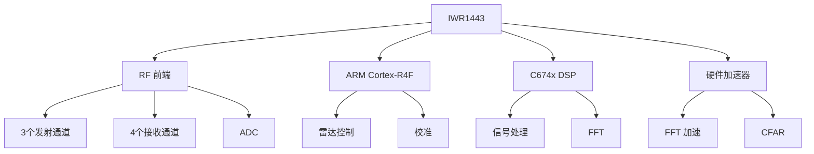

# IWR1443 硬件介绍

TI IWR1443 是 Texas Instruments 推出的 76-81 GHz 单芯片毫米波雷达传感器，集成了雷达前端、ARM 处理器和 DSP，适合汽车和工业应用。

## 芯片架构

### 系统框图



## 主要特性

### RF 性能

| 参数 | 规格 |
|------|------|
| 工作频率 | 76 - 81 GHz |
| 调制带宽 | 最大 4 GHz |
| 发射通道 | 3 个 |
| 接收通道 | 4 个 |
| 发射功率 | 最大 12.5 dBm/通道 |
| 接收噪声系数 | < 15 dB |
| ADC 采样率 | 最高 12.5 Msps |
| ADC 分辨率 | 16 bit |

### 处理能力

**ARM Cortex-R4F**：
- 主频：200 MHz
- 功能：雷达控制、系统管理、校准

**C674x DSP**：
- 主频：600 MHz
- 性能：2400 MMAC（百万次乘累加运算/秒）
- 功能：信号处理、目标检测

**硬件加速器**：
- FFT 加速器：支持最大 4096 点 FFT
- CFAR 加速器：硬件 CFAR 检测

### 存储

- **RAM**：896 KB（L3 + L2）
- **Flash**：无（需要外部 FLASH）
- **接口**：QSPI、LVDS、UART、SPI、I2C、CAN

## IWR1443BOOST 开发板

### 板载资源

```
┌─────────────────────────────────┐
│                                 │
│    [IWR1443 芯片]              │
│                                 │
│  [天线阵列]                     │
│  TX1  TX2  TX3                 │
│  RX1  RX2  RX3  RX4            │
│                                 │
│  [XDS110 调试器]               │
│                                 │
│  [USB 接口] [电源接口]         │
│                                 │
└─────────────────────────────────┘
```

**天线配置**：
- 3 个发射天线（TX）
- 4 个接收天线（RX）
- 天线间距：λ/2 (≈ 1.95 mm)
- 方位角视场：±60°
- 俯仰角视场：±20°

**接口**：
- Micro-USB：供电 + 调试 + 数据传输
- UART：日志输出
- SPI：外部传感器接口
- GPIO：扩展接口

### 性能指标

| 参数 | 典型值 |
|------|--------|
| 最大探测距离 | 80 - 200 m（取决于配置）|
| 距离分辨率 | 4 cm（带宽 4 GHz）|
| 速度范围 | ±100 km/h |
| 速度分辨率 | < 0.5 km/h |
| 方位角分辨率 | 15° - 30° |
| 帧率 | 10 - 50 fps |

## 天线设计

### MIMO 虚拟阵列

使用 MIMO 技术扩展虚拟孔径：

**物理天线**：
- 3 TX × 4 RX = 12 个虚拟接收通道

**虚拟阵列**：
```
TX1: □ □ □ □
TX2: □ □ □ □
TX3: □ □ □ □
     ↓ ↓ ↓ ↓
    RX1 RX2 RX3 RX4
```

### 角度分辨率

方位角分辨率：
$$
\theta_r = \frac{\lambda}{N_v \cdot d} \approx \frac{\lambda}{L_{aperture}}
$$

其中：
- $N_v$ 是虚拟天线数（12）
- $d$ 是天线间距（λ/2）
- $L_{aperture}$ 是阵列孔径

对于 77 GHz，12 个虚拟天线的方位角分辨率约为 15°。

### 波束图

```
  功率
   ^
   |    /\
   |   /  \
   |  /    \
   | /      \
   |/________\______
   -60°  0°  +60°  角度
```

## 工作模式

### 1. 传感器模式

**特点**：
- 芯片自主运行
- 固件运行在 ARM 上
- 处理后的数据通过 UART 输出

**应用**：
- 快速原型
- 嵌入式应用

### 2. 高级帧配置模式

**特点**：
- 灵活的 chirp 配置
- 可自定义信号处理链
- 原始 ADC 数据输出

**应用**：
- 算法开发
- 研究项目
- 定制化应用

## 电源管理

### 功耗

| 工作模式 | 典型功耗 |
|---------|---------|
| 激活模式 | 1.5 - 2 W |
| 低功耗模式 | < 100 mW |
| 深度睡眠 | < 10 mW |

### 热管理

- 工作温度：-40°C 至 +105°C
- 建议使用散热片（高占空比应用）
- 温度传感器：片上集成

## 校准

### 出厂校准

芯片出厂时已进行校准，校准数据存储在 eFUSE 中：
- TX 功率校准
- RX 增益校准
- 相位校准

### 运行时校准

软件可在运行时进行：
- 频率校准
- 温度补偿
- DC 偏移校准

## 与其他芯片对比

| 型号 | IWR1443 | IWR1642 | IWR1843 | AWR1243 |
|------|---------|---------|---------|---------|
| 频率 | 76-81 GHz | 76-81 GHz | 76-81 GHz | 76-81 GHz |
| TX 通道 | 3 | 2 | 3 | 3 |
| RX 通道 | 4 | 4 | 4 | 4 |
| DSP | ✓ | ✓ | ✓ | ✗ |
| ARM | R4F | R4F | R4F | R4F |
| 接口 | LVDS | LVDS | CSI-2 | CSI-2 |
| 应用 | 汽车/工业 | 低成本 | 高级ADAS | 外部处理 |

**选择建议**：
- **IWR1443**：平衡性能和成本
- **IWR1642**：成本敏感应用
- **IWR1843**：需要高带宽数据接口
- **AWR1243**：配合外部高性能处理器

## 应用场景

### 汽车应用

1. **自适应巡航控制（ACC）**
   - 距离：200 m
   - 速度：0 - 200 km/h

2. **盲点检测（BSD）**
   - 距离：50 m
   - 视场角：±80°

3. **自动紧急制动（AEB）**
   - 距离：100 m
   - 反应时间：< 100 ms

### 工业应用

1. **液位监测**
   - 范围：0 - 30 m
   - 精度：± 1 mm

2. **人员检测**
   - 距离：10 - 50 m
   - 跟踪多目标

3. **交通监控**
   - 车速测量
   - 车流统计

### 消费电子

1. **手势识别**
   - 距离：0.5 - 2 m
   - 刷新率：> 20 fps

2. **存在检测**
   - 生命体征监测
   - 智能照明控制

## 设计注意事项

### PCB 设计

1. **RF 走线**
   - 使用受控阻抗（50Ω）
   - 最小化走线长度
   - 避免直角转弯

2. **电源设计**
   - 低噪声 LDO
   - 充足的去耦电容
   - 分离数字和模拟地

3. **热设计**
   - 散热过孔
   - 热垫设计
   - 适当的铜箔厚度

### 天线设计

1. **辐射模式**
   - 避免金属遮挡
   - 保持天线清洁区域

2. **雷达罩**
   - 使用低损耗材料
   - 厚度：λ 的整数倍

## 获取开发板

**购买渠道**：
- [TI 官方商店](https://www.ti.com/)
- 授权分销商：Mouser、Digi-Key、Arrow 等

**价格**：约 $299 USD（参考价）

**套件内容**：
- IWR1443BOOST 评估板
- USB 数据线
- 快速入门指南

---

## 下一步

- [开发环境](development.md) - 软件开发环境搭建
- [FMCW 调制](../mmwave/fmcw.md) - 了解雷达工作原理

## 参考资料

1. Texas Instruments. (2017). *IWR1443 Single-Chip 76- to 81-GHz mmWave Sensor*.
2. Texas Instruments. *IWR1443BOOST User's Guide*.
3. TI mmWave Training Series. [https://training.ti.com/](https://training.ti.com/)
