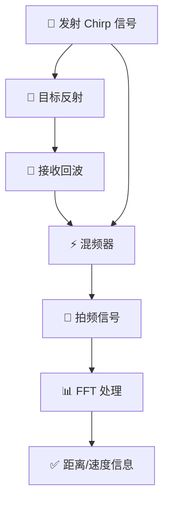
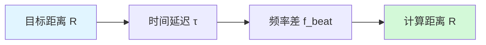

# FMCW 调制

!!! abstract "章节概述"
    调频连续波（**F**requency **M**odulated **C**ontinuous **W**ave, **FMCW**）是毫米波雷达最常用的工作模式，它通过发射频率随时间线性变化的连续波信号来实现目标探测。

    📚 **本章学习路线**：

    1. 🎵 理解 Chirp 信号的本质
    2. 📏 学会通过拍频测量距离
    3. 🚗 掌握速度测量原理
    4. 📊 理解 2D-FFT 信号处理

    ⏱️ **预计时间**：40-50 分钟

!!! tip "前置知识"
    学习本章前建议先了解：

    - 📡 [雷达基本原理](../radar-basics/overview.md)
    - 🌊 [多普勒效应](../radar-basics/doppler-effect.md)
    - 📐 傅里叶变换基础

---

## 🤔 为什么需要 FMCW？

??? question "脉冲雷达 vs FMCW 雷达"
    === "🔴 脉冲雷达"
        **工作方式**：发射短脉冲，测量回波时间

        **优点**：
        - ✅ 原理简单
        - ✅ 峰值功率高

        **缺点**：
        - ❌ 平均功率低
        - ❌ 近距离测量困难
        - ❌ 需要高速 ADC
        - ❌ 功耗大

    === "🟢 FMCW 雷达"
        **工作方式**：连续发射调频信号，测量频率差

        **优点**：
        - ✅ 功耗低（连续发射，低功率）
        - ✅ 近距离性能好
        - ✅ ADC 要求低
        - ✅ 可同时测距和测速

        **缺点**：
        - ❌ 信号处理复杂
        - ❌ 发射泄漏影响大

!!! success "FMCW 的核心优势"
    **汽车雷达为什么选择 FMCW？**

    - 🔋 **低功耗**：适合电池供电
    - 📏 **近距离**：可测量 0.1 米到 200 米
    - 💰 **成本低**：ADC 要求低
    - 🎯 **高精度**：厘米级距离分辨率

---

## 📊 FMCW 基本原理

### 工作机制

FMCW 雷达发射一个频率随时间线性变化的信号（称为 **chirp**），接收目标反射回来的回波信号，通过测量发射信号和接收信号之间的频率差（**拍频**）来确定目标的距离和速度。



### 🎵 Chirp 信号

!!! info "Chirp 信号公式"
    线性调频信号的瞬时频率为：

    $$
    f(t) = f_0 + S \cdot t
    $$

    **参数定义**：

    | 符号 | 参数名称 | 说明 |
    |------|----------|------|
    | $f_0$ | 起始频率 | Chirp 的起始频率值 |
    | $S$ | 调频斜率 | $S = B/T_c$ (Chirp Rate) |
    | $B$ | 调频带宽 | 频率扫描的总带宽 |
    | $T_c$ | Chirp 周期 | 一个 Chirp 的持续时间 |

完整的发射信号表达式为：

$$
\boxed{s_t(t) = A_t \cos\left[2\pi\left(f_0 t + \frac{S t^2}{2}\right) + \phi_0\right]}
$$


> 📊 FMCW Chirp 信号的频率-时间特性：频率随时间线性增加

## 📏 距离测量原理

### 🎯 核心思想

!!! info "测距的关键"
    **时间延迟 → 频率差**

    FMCW 雷达巧妙地将**时间测量**转换为**频率测量**！

**步骤分解**：



### 📐 数学推导

=== "步骤 1：时间延迟"

    电磁波往返目标所需时间：

    $$
    \boxed{\tau = \frac{2R}{c}}
    $$

    !!! example "数值感知"
        - 距离 **10 m** → 延迟 **67 ns**
        - 距离 **100 m** → 延迟 **667 ns**
        - 距离 **1 km** → 延迟 **6.67 μs**

=== "步骤 2：接收信号"

    接收信号相比发射信号**延迟了 $\tau$**：

    $$
    s_r(t) = A_r \cos\left[2\pi\left(f_0 (t-\tau) + \frac{S (t-\tau)^2}{2}\right) + \phi_0\right]
    $$

=== "步骤 3：混频得到拍频"

    

    *📈 FMCW 测距原理图解：发射信号（蓝色）和接收信号（红色）之间的频率差即为拍频*

    **关键观察**：由于 Chirp 信号频率线性增加，时间延迟 $\tau$ 对应一个频率差！

    $$
    f_{beat} = |f_t(t) - f_r(t)| = S \tau = \frac{2SR}{c}
    $$

=== "步骤 4：计算距离"

    !!! success "测距公式"
        $$
        \boxed{R = \frac{c \cdot f_{beat}}{2S} = \frac{c \cdot f_{beat} \cdot T_c}{2B}}
        $$

        **公式解读**：

        - 拍频 $f_{beat}$ 越大 → 距离 $R$ 越远
        - 带宽 $B$ 越大 → 同样拍频对应距离越近（分辨率更高）

??? example "🧮 实际计算案例"
    **雷达参数**：

    - 带宽 $B = 4$ GHz
    - Chirp 时间 $T_c = 100$ μs
    - 调频斜率 $S = B/T_c = 40$ MHz/μs

    **测量结果**：

    - 拍频 $f_{beat} = 800$ kHz

    **计算距离**：
    $$
    R = \frac{3 \times 10^8 \times 800 \times 10^3 \times 100 \times 10^{-6}}{2 \times 4 \times 10^9} = 30 \text{ m}
    $$

    !!! tip "验算"
        也可以用另一个公式：
        $$
        R = \frac{c \cdot f_{beat}}{2S} = \frac{3 \times 10^8 \times 800 \times 10^3}{2 \times 40 \times 10^{12}} = 30 \text{ m}
        $$

### 🎯 距离分辨率

!!! question "什么是距离分辨率？"
    **距离分辨率**是指雷达能够分辨两个相邻目标的最小距离差。

    想象两辆车：如果它们靠得太近，雷达就会把它们当成一个目标！

两个目标可分辨的最小距离差由信号带宽决定：

$$
\boxed{\Delta R = \frac{c}{2B}}
$$

!!! tip "关键洞察"
    **带宽越大，分辨率越高！**

    - 带宽翻倍 → 分辨率提高 2 倍
    - 这就是为什么 4 GHz 带宽的毫米波雷达性能优秀

??? example "不同带宽的分辨率对比"
    | 带宽 $B$ | 距离分辨率 $\Delta R$ | 应用场景 |
    |---------|---------------------|----------|
    | 50 MHz | 3.0 m | 远程监视雷达 |
    | 200 MHz | 0.75 m | 气象雷达 |
    | 1 GHz | 15 cm | 汽车雷达（老一代） |
    | **4 GHz** | **3.75 cm** | **现代毫米波雷达** ⭐ |
    | 8 GHz | 1.9 cm | 高精度测距 |

    !!! success "毫米波雷达的优势"
        4 GHz 带宽可以实现 **厘米级** 的距离分辨率，足以：

        - 🚗 区分前方多辆车
        - 🚴 识别行人和自行车
        - 🛣️ 检测道路边界

### 📊 最大探测距离

最大距离由采样率和 Chirp 时间决定：

$$
\boxed{R_{max} = \frac{c \cdot f_s \cdot T_c}{4B}}
$$

??? info "为什么有最大距离限制？"
    **原因**：拍频不能超过采样率的一半（奈奎斯特定理）

    $$
    f_{beat,max} = \frac{f_s}{2}
    $$

    代入测距公式：
    $$
    R_{max} = \frac{c \cdot f_{beat,max}}{2S} = \frac{c \cdot f_s}{4S} = \frac{c \cdot f_s \cdot T_c}{4B}
    $$

??? example "🎮 参数设计练习"
    **任务**：设计一个汽车防撞雷达

    **需求**：

    - ✅ 最大探测距离：200 m
    - ✅ 距离分辨率：5 cm
    - ✅ 采样率：尽可能低（降低成本）

    **解决方案**：

    **步骤 1**：确定带宽
    $$
    B = \frac{c}{2\Delta R} = \frac{3 \times 10^8}{2 \times 0.05} = 3 \text{ GHz}
    $$

    **步骤 2**：选择 Chirp 时间（假设 $T_c = 50$ μs）

    **步骤 3**：计算所需采样率
    $$
    f_s = \frac{4BR_{max}}{cT_c} = \frac{4 \times 3 \times 10^9 \times 200}{3 \times 10^8 \times 50 \times 10^{-6}} = 16 \text{ MHz}
    $$

    !!! success "设计结果"
        - 带宽：**3 GHz**
        - Chirp 时间：**50 μs**
        - 采样率：**16 MHz** （16-bit ADC 可实现）
        - 距离分辨率：**5 cm** ✅
        - 最大距离：**200 m** ✅

### 最大探测距离

由采样定理，最大不模糊距离取决于采样率：

$$
R_{max} = \frac{c \cdot f_s \cdot T_c}{4B}
$$

其中 $f_s$ 是 ADC 采样率。

或者用另一种形式：

$$
R_{max} = \frac{c}{2 \cdot \Delta f}
$$

其中 $\Delta f = B/N_{samples}$ 是频率分辨率。

## 速度测量

### 多普勒效应的影响

当目标有径向速度 $v_r$ 时，会产生多普勒频移：

$$
f_d = \frac{2v_r}{\lambda} = \frac{2v_r f_0}{c}
$$

这会导致拍频发生偏移。

### 单 Chirp 的局限

单个 chirp 无法区分距离和速度引起的拍频变化，因为：

$$
f_{beat} = f_R + f_d
$$

其中 $f_R$ 是距离分量，$f_d$ 是多普勒分量。

### 解决方案：多 Chirp 处理

发射多个连续的 chirp，形成一个帧（frame）：


> 图：一个 Frame 由多个 Chirp 组成，用于多普勒分析

每个 Frame 包含多个 Chirp，通过对每个 Chirp 的同一距离 bin 进行 FFT 可以提取速度信息。

## 三角波调制

### 上扫频和下扫频

使用三角波调制（up-chirp 和 down-chirp）：


> 图：三角波调制的 FMCW 信号用于同时测距和测速

通过上扫频和下扫频的拍频差异可以解耦距离和速度信息。

### 距离和速度解耦

**上扫频（Up-chirp）**：
$$
f_{beat,up} = f_R + f_d
$$

**下扫频（Down-chirp）**：
$$
f_{beat,down} = f_R - f_d
$$

求和消除多普勒分量：
$$
f_R = \frac{f_{beat,up} + f_{beat,down}}{2}
$$

求差得到多普勒分量：
$$
f_d = \frac{f_{beat,up} - f_{beat,down}}{2}
$$

从而得到：

$$
\boxed{R = \frac{c \cdot f_R \cdot T_c}{2B}}
$$

$$
\boxed{v_r = \frac{\lambda \cdot f_d}{2}}
$$

## 2D-FFT 处理

### 数据立方体

FMCW 雷达采集的原始数据可以表示为三维数据立方体：

```text
维度 1: 快时间（Fast-time）- 单个 chirp 内的采样点
维度 2: 慢时间（Slow-time）- 多个 chirp 之间
维度 3: 通道（Channel）- 多个接收天线
```

### 第一次 FFT：Range FFT

对每个 chirp 的快时间采样进行 FFT，得到距离信息：

$$
S_R(k, m) = \sum_{n=0}^{N-1} s(n, m) \cdot e^{-j2\pi kn/N}
$$

其中：

- $n$ 是快时间采样索引
- $m$ 是 chirp 索引
- $k$ 是距离 bin

结果：**Range Profile**（距离剖面）

### 第二次 FFT：Doppler FFT

对每个距离 bin 的慢时间序列进行 FFT，得到速度信息：

$$
S_{RD}(k, l) = \sum_{m=0}^{M-1} S_R(k, m) \cdot e^{-j2\pi lm/M}
$$

其中：

- $m$ 是 chirp 索引
- $l$ 是速度 bin

结果：**Range-Doppler Map**（距离-多普勒图）


> 图：多维 FFT 处理流程，包括距离、速度和角度维度

### 处理流程


## FMCW 雷达参数设计

### 关键参数

| 参数 | 符号 | 影响 |
|------|------|------|
| 中心频率 | $f_0$ | 波长、天线尺寸、分辨率 |
| 带宽 | $B$ | 距离分辨率 |
| Chirp 时间 | $T_c$ | 最大距离、采样率要求 |
| Chirp 数量 | $N_c$ | 速度分辨率、帧率 |
| 帧时间 | $T_f$ | 速度分辨率、更新率 |
| 采样率 | $f_s$ | 最大距离、ADC 要求 |

### 距离相关参数

**距离分辨率**：
$$
\Delta R = \frac{c}{2B}
$$

**最大距离**：
$$
R_{max} = \frac{c \cdot f_s \cdot T_c}{4B}
$$

**距离 bin 数量**：
$$
N_{range} = \frac{2B \cdot R_{max}}{c} = \frac{f_s \cdot T_c}{2}
$$

### 速度相关参数

**速度分辨率**：
$$
\Delta v = \frac{\lambda}{2T_f} = \frac{\lambda}{2N_c T_c}
$$

**最大速度**（不模糊）：
$$
v_{max} = \frac{\lambda}{4T_c}
$$

**速度 bin 数量**：
$$
N_{velocity} = N_c
$$

### 设计权衡

1. **距离与采样率**
   - 更大的 $R_{max}$ 需要更高的 $f_s$
   - ADC 性能和成本限制

2. **速度与帧率**
   - 更大的 $v_{max}$ 需要更短的 $T_c$
   - 更好的速度分辨率需要更长的 $T_f$（更多 chirp）

3. **带宽与功耗**
   - 更大的 $B$ 提供更好的距离分辨率
   - 但增加功耗和复杂度

## FMCW 雷达的优势

### 1. 低峰值功率

- 连续发射，平均功率等于峰值功率
- 功放设计简单，成本低
- 适合集成电路实现

### 2. 同时测距测速

- 通过 2D-FFT 同时获得距离和速度
- 无需额外的测量周期

### 3. 高距离分辨率

- 大带宽易于实现（毫米波）
- 可达厘米级甚至毫米级分辨率

### 4. 低截获概率

- 信号能量分散在时间和频率上
- 难以被截获和干扰

### 5. 抗干扰能力

- 窄带干扰只影响部分频率
- 可通过信号处理抑制

## FMCW 雷达的挑战

### 1. 频率非线性

**问题**：实际 chirp 的频率并非完全线性

**影响**：

- 距离旁瓣升高
- 分辨率下降
- 虚假目标

**解决方案**：

- 高精度频率源（PLL）
- 频率校准和补偿
- 非线性校正算法

### 2. 发射泄漏

**问题**：发射信号直接泄漏到接收通道

**影响**：

- 饱和接收机
- 近距离盲区
- 动态范围降低

**解决方案**：

- 收发隔离设计
- 自适应对消
- 数字域补偿

### 3. 相位噪声

**问题**：本振相位噪声

**影响**：

- 距离和速度测量误差
- 弱目标被噪声淹没

**解决方案**：

- 高质量振荡器
- 相位噪声补偿算法

### 4. 多径效应

**问题**：信号经多条路径到达目标

**影响**：

- 虚假目标
- 测量误差

**解决方案**：

- 波束形成
- 多径抑制算法
- MIMO 技术

## 实际应用示例

### 示例 1：汽车雷达参数

**需求**：

- 探测距离：0.5 ~ 200 m
- 距离分辨率：< 5 cm
- 速度范围：-100 ~ +100 km/h
- 速度分辨率：< 0.5 km/h

**参数设计**：

1. **距离分辨率**确定带宽：
   $$B \geq \frac{c}{2\Delta R} = \frac{3 \times 10^8}{2 \times 0.05} = 3 \text{ GHz}$$
   选择 $B = 4$ GHz

2. **最大距离**确定采样率（假设 $T_c = 50$ μs）：
   $$f_s \geq \frac{4B R_{max}}{c T_c} = \frac{4 \times 4 \times 10^9 \times 200}{3 \times 10^8 \times 50 \times 10^{-6}} = 213.3 \text{ MHz}$$
   选择 $f_s = 250$ MHz

3. **速度分辨率**确定帧时间（$\lambda = 3.9$ mm）：
   $$T_f \geq \frac{\lambda}{2\Delta v} = \frac{0.0039}{2 \times 0.14} = 14 \text{ ms}$$
   选择 $T_f = 50$ ms（对应帧率 20 Hz）

4. **Chirp 数量**：
   $$N_c = \frac{T_f}{T_c} = \frac{50 \times 10^{-3}}{50 \times 10^{-6}} = 1000$$

### 示例 2：77 GHz 雷达配置

| 参数 | 值 |
|------|-----|
| 中心频率 | 77 GHz |
| 带宽 | 4 GHz |
| Chirp 时间 | 50 μs |
| Chirp 数量 | 128 |
| 帧时间 | 40 ms |
| 采样率 | 10 MHz |
| 采样点数 | 512 |

**性能**：

- 距离分辨率：3.75 cm
- 最大距离：191 m
- 速度分辨率：0.49 km/h
- 最大速度：±98 km/h

## TI mmWave SDK 中的 FMCW

### Chirp 配置

```c
// Chirp 参数配置
rlProfileCfg_t profileCfg = {
    .profileId = 0,
    .startFreq = 77.0,        // GHz
    .idleTime = 5.0,          // μs
    .adcStartTime = 6.0,      // μs
    .rampEndTime = 50.0,      // μs
    .txOutPower = 0,          // dB
    .txPhaseShifter = 0,      // degrees
    .freqSlopeConst = 80.0,   // MHz/μs
    .txStartTime = 0,         // μs
    .numAdcSamples = 512,
    .digOutSampleRate = 10000,// ksps
    .hpfCornerFreq1 = 0,
    .hpfCornerFreq2 = 0,
    .rxGain = 30              // dB
};
```

### Frame 配置

```c
// Frame 参数配置
rlFrameCfg_t frameCfg = {
    .chirpStartIdx = 0,
    .chirpEndIdx = 127,
    .numLoops = 1,
    .numFrames = 0,           // 连续模式
    .framePeriodicity = 40,   // ms
    .triggerSelect = 1,       // SW trigger
    .frameTriggerDelay = 0    // μs
};
```

---

## 下一步

- [信号处理](signal-processing.md) - 深入 FMCW 信号处理算法
- [目标检测](target-detection.md) - 了解 CFAR 检测方法
- [IWR1443 硬件](../iwr1443/hardware.md) - 学习 TI 雷达平台

## 参考资料

1. Rohling, H. (2014). "Radar CFAR Thresholding in Clutter and Multiple Target Situations". *IEEE Transactions on Aerospace and Electronic Systems*.
2. Texas Instruments. (2017). *mmWave Radar Sensors*. Application Report.
3. Patole, S. M., et al. (2017). "Automotive Radars: A Review of Signal Processing Techniques". *IEEE Signal Processing Magazine*.
