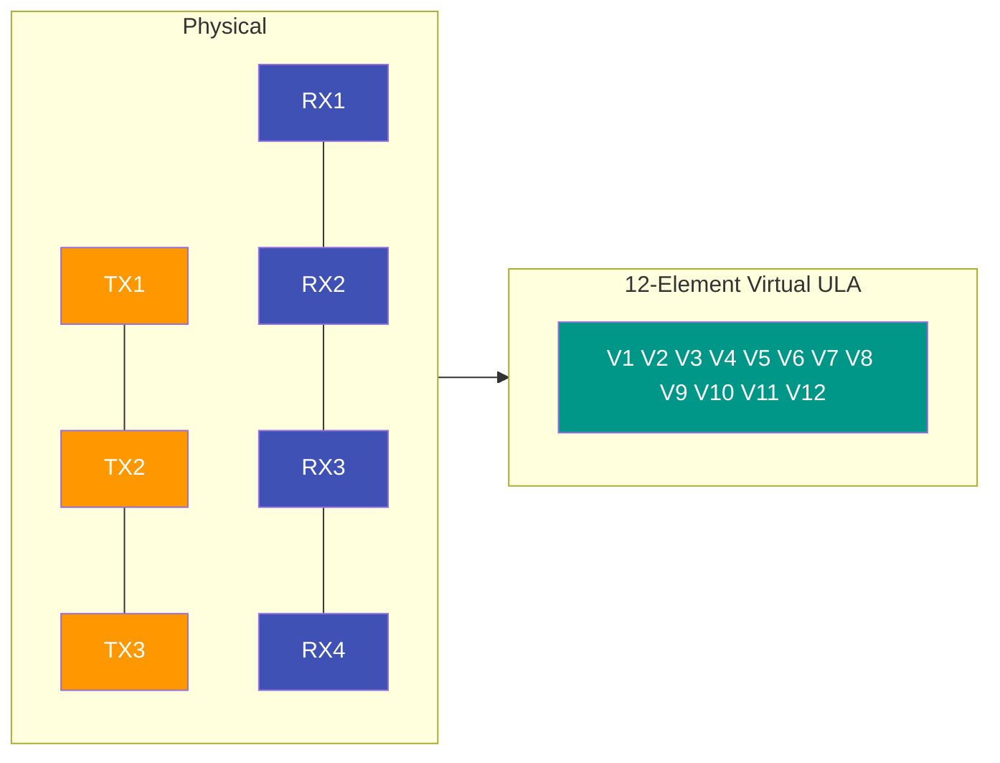

# MIMO 与 DOA 估计

!!! abstract "章节概述"
    现代毫米波雷达的角度估计能力依赖 **MIMO 技术** 与 **自适应波束形成/子空间类 DOA 算法**。本章系统介绍：

    1. MIMO 的三大复用方式（TDM / FDM / BPM / DDMA）
    2. 虚拟阵列的数学构造
    3. 古典波束形成 → Capon → MUSIC / ESPRIT 的演进
    4. 工程选型与实现代码

    ⏱️ **预计时间**：50 分钟
    🎯 **前置知识**：[信号处理](signal-processing.md) · [目标检测](target-detection.md)

---

## 🎯 1. 为什么需要 MIMO？

单发单收（SISO）雷达无法测角。SIMO（单发多收）可通过接收阵列测角，角度分辨率受限于接收天线数 $N_{\text{RX}}$：

$$
\Delta\theta_{\text{SIMO}} \approx \frac{\lambda}{N_{\text{RX}} d \cos\theta}
$$

MIMO 雷达让 $N_{\text{TX}}$ 个发射天线发射 **相互正交** 的波形，利用 $N_{\text{TX}} \times N_{\text{RX}}$ 对收发路径形成 **虚拟阵列**，等效孔径扩大为：

$$
N_{\text{virt}} = N_{\text{TX}} \cdot N_{\text{RX}}
$$

!!! example "IWR1443 案例"
    3 TX × 4 RX = **12 虚拟阵元**，在保持硬件规模不变的前提下显著提升角度分辨率。

---

## 🔁 2. 波形正交复用方式

=== "TDM-MIMO（时分）"
    各 TX **按时间轮流发射**，接收端通过 Chirp 索引区分 TX。

    - ✅ 硬件简单，TI IWR/AWR 默认方案
    - ❌ 等效 PRF 降为 $1/N_{\text{TX}}$ ⇒ 最大无模糊速度下降
    - ❌ 快速目标需要 **速度补偿**（不同 TX 发射时刻相位差）

=== "BPM-MIMO（相位调制）"
    多 TX 同时发射，每个 Chirp 用二进制相位码（如 Hadamard 矩阵）编码。
    接收端通过相同编码解码分离各 TX。

    - ✅ 保持完整 PRF
    - ✅ SNR 提升 $10\log_{10}(N_{\text{TX}})$ dB
    - ❌ 硬件需要高速相位切换

=== "DDMA（多普勒分频）"
    各 TX 在多普勒域分配不同子带（通过逐 Chirp 线性相位）。

    - ✅ 完整 PRF，可软件实现
    - ❌ 可用多普勒带宽减小为 $1/N_{\text{TX}}$

=== "FDM（频分）"
    不同 TX 占用不同中心频率。极少用于汽车雷达（带宽受限、校准复杂）。

---

## 🧮 3. 虚拟阵列的数学构造

设 $N_{\text{TX}}$ 个发射阵元位置 $\mathbf{p}^{t}_i$，$N_{\text{RX}}$ 个接收阵元位置 $\mathbf{p}^{r}_j$，单目标角度 $\theta$ 的回波相位为：

$$
\phi_{ij}(\theta) = \frac{2\pi}{\lambda}\left(\mathbf{p}^{t}_i + \mathbf{p}^{r}_j\right) \cdot \mathbf{u}(\theta)
$$

其中 $\mathbf{u}(\theta)$ 是单位方向矢量。**虚拟阵元位置** 即为：

$$
\mathbf{p}^{v}_{ij} = \mathbf{p}^{t}_i + \mathbf{p}^{r}_j
$$

!!! tip "IWR1443 虚拟阵列设计"
    3 TX 间距 $2\lambda$、4 RX 间距 $\lambda/2$，得到间距为 $\lambda/2$ 的 **12 元均匀线阵**，等效孔径 $5.5\lambda$。



---

## 🧠 4. DOA 算法演进

| 算法 | 类型 | 分辨率 | 复杂度 | 是否需要信源数 |
|---|---|---|---|---|
| FFT / 常规波束形成 | 非自适应 | $\sim 1/N$ | $O(N \log N)$ | 否 |
| Capon (MVDR) | 自适应 | $\sim 1/(N \cdot \text{SNR})$ | $O(N^3)$ | 否 |
| MUSIC | 子空间 | 超分辨 | $O(N^3)$ | 是 |
| ESPRIT | 子空间 | 超分辨 | $O(N^3)$ | 是 |
| Root-MUSIC | 子空间多项式 | 超分辨 | $O(N^3)$ | 是 |

### 4.1 Capon（MVDR）波束形成

在保持期望方向增益为 1 的约束下，最小化阵列输出功率：

$$
\min_\mathbf{w}\ \mathbf{w}^H\mathbf{R}\mathbf{w}\quad \text{s.t.}\ \mathbf{w}^H\mathbf{a}(\theta)=1
$$

解得：

$$
\boxed{\ P_{\text{Capon}}(\theta) = \frac{1}{\mathbf{a}(\theta)^H \mathbf{R}^{-1} \mathbf{a}(\theta)}\ }
$$

Python 实现：

```python
import numpy as np

def capon_doa(X, num_antennas, d_over_lambda=0.5,
              theta_scan=np.linspace(-90, 90, 1801), diagonal_load=1e-3):
    """Capon / MVDR 角度谱"""
    R = X @ X.conj().T / X.shape[1]
    R += diagonal_load * np.trace(R) / num_antennas * np.eye(num_antennas)
    R_inv = np.linalg.inv(R)

    n = np.arange(num_antennas).reshape(-1, 1)
    A = np.exp(-1j * 2 * np.pi * d_over_lambda * n * np.sin(np.deg2rad(theta_scan)))
    P = 1.0 / np.real(np.einsum('nk,nm,mk->k', A.conj(), R_inv, A) + 1e-12)
    return 10 * np.log10(P / P.max()), theta_scan
```

!!! info "Capon vs MUSIC"
    - **Capon** 不需要信源数，对相干源更稳健，谱峰宽但可靠。
    - **MUSIC** 分辨率更高，但依赖信源数估计和子空间假设。

### 4.2 ESPRIT（旋转不变子空间）

ESPRIT 利用 ULA 的平移不变性，将角度估计转化为 **广义特征值问题**，无需谱搜索，计算更快。

核心步骤：

1. 信号子空间 $\mathbf{U}_s \in \mathbb{C}^{N\times P}$
2. 拆分为上下子阵：$\mathbf{U}_1 = \mathbf{U}_s(1\!:\!N\!-\!1,:),\ \mathbf{U}_2 = \mathbf{U}_s(2\!:\!N,:)$
3. 求解 $\mathbf{U}_2 = \mathbf{U}_1 \mathbf{\Psi}$ 的特征值 $\phi_i = \angle \lambda_i$
4. 角度：$\theta_i = \arcsin\!\big(\phi_i / (2\pi d/\lambda)\big)$

```python
def esprit_doa(X, num_sources, num_antennas, d_over_lambda=0.5):
    R = X @ X.conj().T / X.shape[1]
    eigvals, eigvecs = np.linalg.eigh(R)
    Us = eigvecs[:, np.argsort(eigvals)[::-1][:num_sources]]
    U1, U2 = Us[:-1, :], Us[1:, :]
    Psi = np.linalg.pinv(U1) @ U2
    phi = np.angle(np.linalg.eigvals(Psi))
    return np.rad2deg(np.arcsin(phi / (2 * np.pi * d_over_lambda)))
```

---

## 🚧 5. TDM-MIMO 速度补偿

TDM 下，不同 TX 发射时刻不同，运动目标会在虚拟阵列上引入 **跨 TX 的多普勒相位误差**：

$$
\Delta\phi = 2\pi f_d T_c \cdot k,\ k=0,1,\dots,N_{\text{TX}}-1
$$

必须在 DOA 估计前 **扣除** $\Delta\phi$，否则角度估计会偏移。标准做法：

1. Range-Doppler FFT 获得目标的 $f_d$
2. 计算每个 TX 相对第一个 TX 的相位补偿
3. 对虚拟阵列数据逐目标相位旋转
4. 再做角度 FFT / MUSIC

---

## 🛠 6. 工程选型建议

| 场景 | 推荐算法 |
|---|---|
| 实时嵌入式（DSP/FPGA）、角度冗余 | **Angle-FFT + Zero Padding** |
| 需要自适应抑制旁瓣 | **Capon** |
| 多密集目标、非相干 | **MUSIC** |
| 低计算量 + 超分辨 | **ESPRIT / Root-MUSIC** |
| 相干多径环境 | **Capon + 空间平滑** 或 **FBSS-MUSIC** |

---

## 📚 扩展阅读

- Van Trees, *Optimum Array Processing*, Wiley, 2002.
- H. Sun et al., "MIMO Radar for Advanced Driver-Assistance Systems and Autonomous Driving", *IEEE Signal Processing Magazine*, 2020.
- TI Application Report **SWRA554A**: *MIMO Radar*
- [目标检测算法](target-detection.md) · [高级主题](advanced-topics.md)
