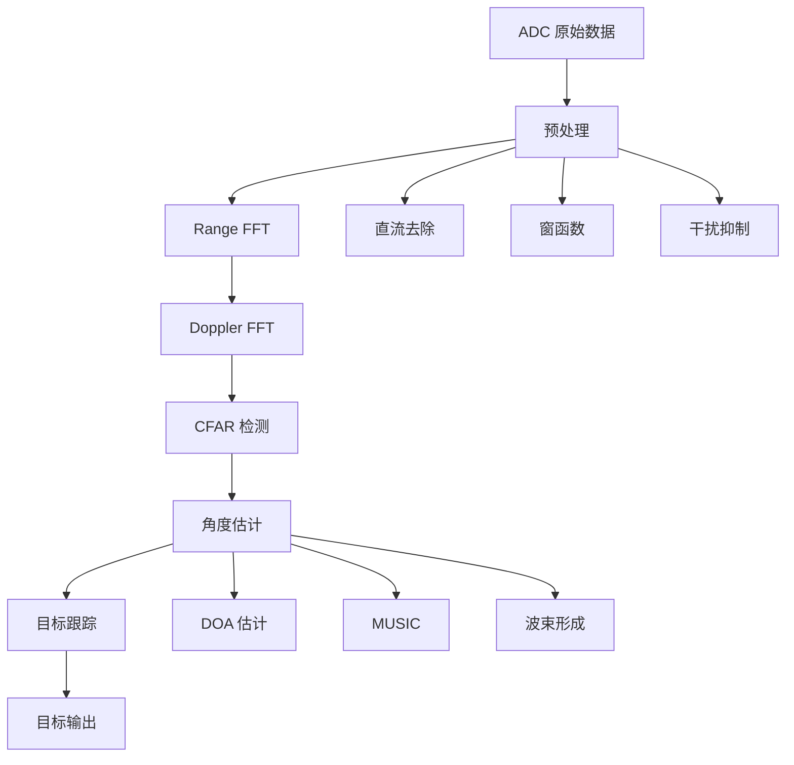

# 信号处理


3. Finn, H. M., & Johnson, R. S. (1968). "Adaptive Detection Mode with Threshold Control".2. Rohling, H. (1983). "Radar CFAR Thresholding in Clutter".1. Richards, M. A. (2014). *Fundamentals of Radar Signal Processing*.## 参考资料- [开发环境](../iwr1443/development.md) - 软件开发环境搭建- [IWR1443 硬件](../iwr1443/hardware.md) - TI 雷达硬件平台## 下一步---- 预计算门限因子- 并行处理多个 CUT- 使用滑动窗口避免重复计算### 3. 计算优化- 杂波边缘：GO-CFAR, SO-CFAR- 多目标：OS-CFAR, SO-CFAR- 均匀噪声：CA-CFAR### 2. 环境适应- **虚警概率**：根据应用需求设置- **保护单元数**：根据目标尺寸选择- **训练单元数**：太少 → 噪声估计不准；太多 → 响应慢### 1. 参数调优## 实际应用注意事项```    }        'false_negatives': false_negatives        'false_positives': false_positives,        'true_positives': true_positives,        'f1_score': f1_score,        'recall': recall,        'precision': precision,    return {        f1_score = 2 * precision * recall / (precision + recall + 1e-10)    recall = true_positives / (true_positives + false_negatives + 1e-10)    precision = true_positives / (true_positives + false_positives + 1e-10)    # 计算指标                false_positives += 1        if not matched:                        break                matched = True                false_negatives -= 1                true_positives += 1            if distance < distance_threshold:            )                (det['doppler_idx'] - gt['doppler_idx'])**2                (det['range_idx'] - gt['range_idx'])**2 +            distance = np.sqrt(        for gt in ground_truth:        matched = False    for det in detections:    # 匹配检测与真值        false_negatives = len(ground_truth)    false_positives = 0    true_positives = 0    """    评估检测性能    """def evaluate_detection(detections, ground_truth, distance_threshold=2):```python### 检测性能指标## 性能评估- 在非预测位置提高门限- 在预测位置降低检测门限结合目标跟踪器，利用运动连续性：### 跟踪辅助检测```    pass    # 只保留在多帧中持续出现的目标    # 对检测历史进行投票    """    多帧检测积累，抑制偶发虚警    """def multi_frame_detection(detection_history, min_frames=3):```python### 多帧积累## 虚警抑制```    return targets            })            'power': rdmap[max_pos]            'doppler_idx': max_pos[1],            'range_idx': max_pos[0],        targets.append({                max_pos = maximum_position(region_data)        region_data = rdmap * region_mask        region_mask = labeled == i    for i in range(1, num_features + 1):    targets = []    # 在每个区域找最大值        labeled, num_features = label(detection_map)    # 标记连通区域            detection_map[d['range_idx'], d['doppler_idx']] = True    for d in detections:    detection_map = np.zeros_like(rdmap, dtype=bool)    # 创建二值检测图    """    在检测区域中选择局部最大值    """def peak_selection(rdmap, detections, neighborhood_size=(3, 3)):from scipy.ndimage import label, maximum_position```python在每个连通区域选择最大值：#### 2. 峰值选择```    return targets            })            'num_points': len(cluster_dets)            'snr': np.max(weights) / np.mean(weights[:5]),            'doppler_idx': doppler_idx,            'range_idx': range_idx,        targets.append({                                         weights=weights)        doppler_idx = np.average([d['doppler_idx'] for d in cluster_dets],                              weights=weights)        range_idx = np.average([d['range_idx'] for d in cluster_dets],         weights = np.array([d['power'] for d in cluster_dets])        # 计算加权质心                cluster_dets = [d for d, m in zip(detections, cluster_mask) if m]        cluster_mask = clustering.labels_ == label                    continue        if label == -1:  # 噪声点    for label in set(clustering.labels_):    targets = []    # 对每个簇计算质心        clustering = DBSCAN(eps=eps, min_samples=min_samples).fit(positions)    # DBSCAN 聚类                             for d in detections])    positions = np.array([[d['range_idx'], d['doppler_idx']]     # 提取位置            return []    if len(detections) == 0:    """    使用 DBSCAN 聚类检测点    """def cluster_detections(detections, eps=2, min_samples=2):from sklearn.cluster import DBSCAN```python基于密度的聚类：#### 1. DBSCAN### 聚类方法CFAR 可能在单个目标周围产生多个检测点。### 问题## 目标聚类与关联```    return detections                    })                    'power': rdmap[r, d]                    'snr': rdmap[r, d] / noise_level,                    'doppler_idx': d,                    'range_idx': r,                detections.append({            if rdmap[r, d] > threshold:            threshold = alpha * noise_level            # 检测                        noise_level = np.mean(training_data)            training_data = window[guard_mask]            # 计算噪声水平                                  train_d:train_d+2*guard_d+1] = False            guard_mask[train_r:train_r+2*guard_r+1,             guard_mask = np.ones_like(window, dtype=bool)            # 移除保护单元和 CUT                        window = rdmap[r_min:r_max, d_min:d_max].copy()                        d_max = d + train_d + guard_d + 1            d_min = d - train_d - guard_d            r_max = r + train_r + guard_r + 1            r_min = r - train_r - guard_r            # 提取窗口                    for d in range(train_d + guard_d, cols - train_d - guard_d):    for r in range(train_r + guard_r, rows - train_r - guard_r):    # 遍历所有可能的 CUT        detections = []        alpha = N_T * (pfa**(-1/N_T) - 1)    # 门限因子        N_T = total_cells - guard_area    guard_area = (2*guard_r + 1) * (2*guard_d + 1)    total_cells = (2*train_r + 2*guard_r + 1) * (2*train_d + 2*guard_d + 1)    # 总训练单元数        train_r, train_d = training_cells    guard_r, guard_d = guard_cells    rows, cols = rdmap.shape    """        training_cells: (range_train, doppler_train)        guard_cells: (range_guard, doppler_guard)        rdmap: Range-Doppler map    参数:        2D CA-CFAR 检测    """def ca_cfar_2d(rdmap, guard_cells=(2, 2), training_cells=(4, 4), pfa=1e-6):```python### Python 实现$$\hat{Z} = \min(\hat{Z}_{left}, \hat{Z}_{right})$$在多目标环境中使用：### SO-CFAR (Smallest Of)选择两侧训练单元中较大的噪声估计。$$\hat{Z} = \max(\hat{Z}_{left}, \hat{Z}_{right})$$在非均匀杂波环境中使用：### GO-CFAR (Greatest Of)```T T T T T T TT G G G G G TT G G CUT G G TT G G G G G TT T T T T T T训练单元围绕检测单元形成矩形窗口：```在 Range-Doppler Map 上进行 2D CFAR 检测。### Range-Doppler 域检测## 2D-CFAR```    return detections                detections.append(i)        if data[i] > threshold:        threshold = alpha * noise_level        # 检测                noise_level = sorted_training[k]        sorted_training = np.sort(training_data)        # 排序并选择第 k 个                training_data = np.concatenate([left_train, right_train])        right_train = data[i + guard_cells + 1 : i + guard_cells + training_cells + 1]        left_train = data[i - guard_cells - training_cells : i - guard_cells]        # 提取训练单元                           n - guard_cells - training_cells):    for i in range(guard_cells + training_cells,         detections = []        alpha = N_T * (pfa**(-1/N_T) - 1)    # 计算门限因子（需要针对 OS-CFAR 调整）        k = int(k_factor * N_T)  # OS索引    N_T = 2 * training_cells    n = len(data)    """    1D OS-CFAR 检测    """def os_cfar_1d(data, guard_cells=2, training_cells=8, pfa=1e-6, k_factor=0.75):```python### Python 实现- 对杂波边缘不敏感- 在多目标环境中性能更好- 对干扰目标鲁棒### 优势3. **计算门限并判决**（同 CA-CFAR）   通常取 $k = 3N_T/4$      $$   \hat{Z} = x_{(k)}   $$2. **选择统计量**：取第 $k$ 大的值   $$   x_{(1)} \leq x_{(2)} \leq \cdots \leq x_{(N_T)}   $$1. **排序**：将训练单元按幅度排序### 算法步骤使用训练单元的**有序统计量**（如中值）而非均值，对异常值更鲁棒。### 算法思想## OS-CFAR (Ordered Statistics)```    return detections                detections.append(i)        if data[i] > threshold:        # 检测                threshold = alpha * noise_level        # 计算门限                noise_level = np.mean(np.concatenate([left_train, right_train]))        # 计算平均噪声功率                right_train = data[i + guard_cells + 1 : i + guard_cells + training_cells + 1]        left_train = data[i - guard_cells - training_cells : i - guard_cells]        # 提取训练单元                           n - guard_cells - training_cells):    for i in range(guard_cells + training_cells,     # 遍历所有 CUT        detections = []        alpha = N_T * (pfa**(-1/N_T) - 1)    # 计算门限因子        N_T = 2 * training_cells    n = len(data)    """    1D CA-CFAR 检测    """def ca_cfar_1d(data, guard_cells=2, training_cells=8, pfa=1e-6):import numpy as np```python### Python 实现    $$    \alpha = 16 \times (10^{6/16} - 1) \approx 3.77    $$    $N_T = 16$，$P_{fa} = 10^{-6}$：!!! example "示例"$$\alpha = N_T \left(P_{fa}^{-1/N_T} - 1\right)$$对于所需虚警概率 $P_{fa}$：### 门限因子   $$   \end{cases}   \text{No Target}, & \text{if } x_{CUT} \leq T   \text{Target}, & \text{if } x_{CUT} > T \\\\   \begin{cases}   $$3. **判决**：   $$   T = \alpha \cdot \hat{Z}   $$2. **计算门限**：   其中 $N_T$ 是训练单元数。      $$   \hat{Z} = \frac{1}{N_T} \sum_{i \in \text{Training}} x_i   $$1. **计算平均噪声功率**：### 算法步骤- **Training Cells**：训练单元，用于估计噪声水平- **Guard Cells**：保护单元，防止目标能量泄漏- **CUT**（Cell Under Test）：待检测单元```[T][T][T] [G][G]    [CUT]    [G][G]  [T][T][T]训练单元  保护单元  检测单元  保护单元  训练单元```最简单也是最常用的 CFAR 算法。### 算法结构## CA-CFAR (Cell Averaging)- $\alpha$ 是门限因子，由所需 $P_{fa}$ 决定- $\hat{\sigma}_n^2$ 是估计的噪声功率其中：$$T = \alpha \cdot \hat{\sigma}_n^2$$3. 将检测单元与门限比较2. 根据噪声功率自适应设置门限1. 估计局部噪声/杂波功率### CFAR 基本思想**解决**：自适应调整门限，保持 $P_{fa}$ 恒定- 噪声弱时：$P_d$ 降低- 噪声强时：$P_{fa}$ 升高**问题**：固定门限在不同环境下性能差异大### 为什么需要 CFAR？## CFAR 算法```   +--------> Pfa   |/   | /   |  /   |   /   |    /Pd ^```接收机工作特性曲线（Receiver Operating Characteristic）描述 $P_d$ 和 $P_{fa}$ 的关系。### ROC 曲线关系：$P_m = 1 - P_d$| 漏检概率 | $P_m$ | 目标存在时未检测到的概率 | 接近 0 || 虚警概率 | $P_{fa}$ | 无目标时错误报警的概率 | 接近 0 || 检测概率 | $P_d$ | 目标存在时正确检测的概率 | 接近 1 ||------|------|------|--------|| 指标 | 符号 | 定义 | 理想值 |### 性能指标其中 $T$ 是检测门限。$$\end{cases}H_0, & \text{if } x \leq TH_1, & \text{if } x > T \\\\\begin{cases}$$决策规则：- **H₁（假设1）**：有信号加噪声，存在目标- **H₀（假设0）**：仅有噪声，无目标雷达检测是一个二元假设检验问题：### 统计决策## 检测理论基础目标检测是雷达信号处理的关键步骤，需要在噪声和杂波环境中可靠地检测到真实目标。CFAR（Constant False Alarm Rate，恒虚警率）是最常用的自适应检测算法。FMCW 雷达的信号处理是从原始 ADC 数据中提取目标信息的关键步骤。本章介绍常用的信号处理技术和算法。

## 信号处理流程

典型的 FMCW 雷达信号处理链路：



## 数据预处理

### 1. 直流分量去除

**问题**：发射泄漏和静态反射产生直流偏置

**方法**：减去均值

$$
s'(n) = s(n) - \frac{1}{N}\sum_{i=0}^{N-1} s(i)
$$

### 2. 窗函数

**目的**：减少频谱泄漏，降低旁瓣

**常用窗函数**：

| 窗函数 | 主瓣宽度 | 旁瓣电平 | 特点 |
|--------|---------|---------|------|
| 矩形窗 | 最窄 | -13 dB | 最佳分辨率，最差旁瓣 |
| 汉宁窗 | 中等 | -32 dB | 平衡性能 |
| 汉明窗 | 中等 | -43 dB | 较好旁瓣抑制 |
| 布莱克曼窗 | 较宽 | -58 dB | 优秀旁瓣抑制 |
| 凯泽窗 | 可调 | 可调 | 灵活可调 |

**汉宁窗**：
$$
w(n) = 0.5 \left[1 - \cos\left(\frac{2\pi n}{N-1}\right)\right]
$$

**应用**：
```python
import numpy as np

# 对快时间应用窗函数
window = np.hanning(num_samples)
data_windowed = data * window[:, np.newaxis]

# 对慢时间应用窗函数
window_doppler = np.hanning(num_chirps)
data_windowed *= window_doppler[np.newaxis, :]
```

### 3. 静态杂波抑制

**MTI（Moving Target Indication）滤波器**：

一阶 MTI：
$$
y(m) = x(m) - x(m-1)
$$

高通滤波器：
$$
H(z) = 1 - z^{-1}
$$

## Range FFT

### 原理

对每个 chirp 的快时间采样进行 FFT：

$$
X_R(k) = \sum_{n=0}^{N-1} x(n) w(n) e^{-j2\pi kn/N}
$$

其中：
- $x(n)$ 是 ADC 采样
- $w(n)$ 是窗函数
- $k$ 是 range bin 索引

### 距离计算

Range bin $k$ 对应的距离：

$$
R_k = \frac{c \cdot k}{2B} \cdot \frac{N}{N_{samples}}
$$

### 零填充

增加 FFT 点数可以提高频谱的插值精度：

$$
N_{FFT} = 2^{\lceil \log_2(N_{samples}) \rceil} \times \text{ZeroPadFactor}
$$

!!! note "零填充不能提高分辨率"
    零填充只是插值，不能超越由带宽决定的本质分辨率 $\Delta R = c/(2B)$

## Doppler FFT

### 原理

对每个 range bin 的慢时间序列进行 FFT：

$$
X_{RD}(k, l) = \sum_{m=0}^{M-1} X_R(k, m) w_D(m) e^{-j2\pi lm/M}
$$

其中：
- $X_R(k, m)$ 是第 $m$ 个 chirp 的第 $k$ 个 range bin
- $w_D(m)$ 是多普勒窗函数
- $l$ 是 velocity bin 索引

### 速度计算

Velocity bin $l$ 对应的速度：

$$
v_l = \frac{\lambda}{2T_f} \left(l - \frac{M}{2}\right)
$$

其中 $T_f = M \cdot T_c$ 是帧时间。

### Range-Doppler Map

2D-FFT 的结果是 Range-Doppler 图：

- 横轴：距离
- 纵轴：速度
- 幅度：目标强度

```
速度
  ^
  |     *  
  |  *     *
  | *       *
  |  *     *
  |     *
  +-------------> 距离
```

## 相位处理

### 相位信息的重要性

FFT 输出是复数，包含幅度和相位：

$$
X(k) = |X(k)| e^{j\phi(k)}
$$


*图：不同接收天线之间的相位差用于角度估计*

相位信息用于：
- 角度估计
- 微多普勒分析
- 相位差测距
- 干涉测量

### 相位展开

相位范围限制在 $[-\pi, \pi]$，需要展开：

$$
\phi_{unwrap}(n) = \phi(n) + 2\pi k
$$

其中 $k$ 使相位连续。

## 角度估计

### 多天线系统

使用多个接收天线可以估计目标的到达角（DOA）：


*图：双接收天线系统的相位差示意图*

天线间距通常为 $d = \lambda/2$，这样可以避免角度模糊。

### 相位差测角

相邻天线之间的相位差：

$$
\Delta \phi = \frac{2\pi d}{\lambda} \sin\theta
$$


*图：通过多天线的相位差进行角度估计*

角度估计：

$$
\theta = \arcsin\left(\frac{\lambda \Delta \phi}{2\pi d}\right)
$$

### 数字波束形成（DBF）

Beamforming 权重：

$$
w_i = e^{-j 2\pi d i \sin\theta / \lambda}
$$

输出：

$$
y(\theta) = \sum_{i=0}^{N_a-1} w_i x_i
$$

### MUSIC 算法

**MU**ltiple **SI**gnal **C**lassification：

1. 计算协方差矩阵：
   $$R = \mathbb{E}[\mathbf{x}\mathbf{x}^H]$$

2. 特征值分解：
   $$R = U\Lambda U^H$$

3. 信号子空间和噪声子空间分离

4. MUSIC 谱：
   $$P_{MUSIC}(\theta) = \frac{1}{\mathbf{a}^H(\theta)U_n U_n^H \mathbf{a}(\theta)}$$

其中 $\mathbf{a}(\theta)$ 是阵列导向矢量。

## 干扰抑制

### 干扰类型

1. **射频干扰（RFI）**
   - 其他雷达
   - 通信信号
   - 窄带干扰

2. **多径干扰**
   - 地面反射
   - 建筑物反射

### 干扰抑制方法

#### 1. 时域滤波

中值滤波：
```python
from scipy.signal import medfilt
data_filtered = medfilt(data, kernel_size=5)
```

#### 2. 频域抑制

检测并置零干扰频率 bin：
```python
# 检测异常高能量的 bin
threshold = np.mean(spectrum) + 3 * np.std(spectrum)
interference_bins = np.where(spectrum > threshold)
spectrum[interference_bins] = 0
```

#### 3. 子空间投影

将接收信号投影到正交于干扰子空间的空间。

## 实际实现示例

### Python 完整处理链路

```python
import numpy as np
from scipy import signal
from scipy.fft import fft, fft2

def process_radar_data(adc_data, params):
    """
    FMCW 雷达信号处理
    
    参数:
        adc_data: shape (num_rx, num_samples, num_chirps)
        params: 雷达参数字典
    
    返回:
        range_doppler_map: shape (num_samples, num_chirps)
        detections: 检测到的目标列表
    """
    num_rx, num_samples, num_chirps = adc_data.shape
    
    # 1. 预处理
    # 直流去除
    adc_data = adc_data - np.mean(adc_data, axis=1, keepdims=True)
    
    # 2. Range FFT
    # 应用窗函数
    window_range = np.hanning(num_samples)
    data_windowed = adc_data * window_range[np.newaxis, :, np.newaxis]
    
    # FFT
    range_fft = fft(data_windowed, n=num_samples, axis=1)
    
    # 3. Doppler FFT
    # 应用窗函数
    window_doppler = np.hanning(num_chirps)
    range_fft_windowed = range_fft * window_doppler[np.newaxis, np.newaxis, :]
    
    # FFT (Doppler dimension)
    range_doppler = fft(range_fft_windowed, n=num_chirps, axis=2)
    
    # 4. 计算功率谱
    # 对多个接收通道求和
    range_doppler_map = np.sum(np.abs(range_doppler)**2, axis=0)
    
    # 5. CFAR 检测
    detections = cfar_2d(range_doppler_map, params['cfar_params'])
    
    # 6. 角度估计（如果有多天线）
    if num_rx > 1:
        for det in detections:
            angle = estimate_angle(
                range_doppler[:, det['range_idx'], det['doppler_idx']],
                params['antenna_spacing']
            )
            det['angle'] = angle
    
    return range_doppler_map, detections

def cfar_2d(data, params):
    """
    2D CFAR 目标检测
    """
    # 参数
    guard_cells = params['guard_cells']
    training_cells = params['training_cells']
    pfa = params['pfa']
    
    # 计算 CFAR 门限
    threshold_factor = training_cells * (pfa**(-1/training_cells) - 1)
    
    detections = []
    
    # 遍历所有单元（简化版本）
    for r in range(guard_cells + training_cells, 
                   data.shape[0] - guard_cells - training_cells):
        for d in range(guard_cells + training_cells,
                       data.shape[1] - guard_cells - training_cells):
            
            # 提取训练单元
            # （这里需要完整实现 CA-CFAR 逻辑）
            
            # 检测
            if data[r, d] > threshold:
                detections.append({
                    'range_idx': r,
                    'doppler_idx': d,
                    'snr': data[r, d] / noise_level
                })
    
    return detections

def estimate_angle(channel_data, antenna_spacing):
    """
    基于相位差的角度估计
    """
    # 计算相位
    phases = np.angle(channel_data)
    
    # 相位差
    phase_diff = phases[1] - phases[0]
    
    # 角度估计
    wavelength = 3e8 / 77e9  # 77 GHz
    angle = np.arcsin(wavelength * phase_diff / (2 * np.pi * antenna_spacing))
    
    return np.degrees(angle)
```

### MATLAB 实现

```matlab
function [rdMap, detections] = processRadarData(adcData, params)
    % FMCW 雷达信号处理
    
    [numRx, numSamples, numChirps] = size(adcData);
    
    %% 1. 预处理
    % 直流去除
    adcData = adcData - mean(adcData, 2);
    
    %% 2. Range FFT
    % 窗函数
    windowRange = hanning(numSamples)';
    adcWindowed = adcData .* windowRange;
    
    % FFT
    rangeFft = fft(adcWindowed, numSamples, 2);
    
    %% 3. Doppler FFT
    % 窗函数
    windowDoppler = hanning(numChirps)';
    rangeFftWindowed = rangeFft .* windowDoppler;
    
    % FFT
    rangeDoppler = fft(rangeFftWindowed, numChirps, 3);
    
    %% 4. 功率谱
    rdMap = sum(abs(rangeDoppler).^2, 1);
    rdMap = squeeze(rdMap);
    
    %% 5. CFAR 检测
    detections = cfar2D(rdMap, params.cfarParams);
    
    %% 6. 角度估计
    if numRx > 1
        for i = 1:length(detections)
            r = detections(i).rangeIdx;
            d = detections(i).dopplerIdx;
            angle = estimateAngle(rangeDoppler(:, r, d), params.lambda);
            detections(i).angle = angle;
        end
    end
end
```

## 性能优化

### 1. 计算优化

- 使用 FFT 而非 DFT
- 选择 $2^n$ 的 FFT 点数
- 并行处理多个通道
- GPU 加速（CUDA）

### 2. 内存优化

- 流式处理
- 减少数据拷贝
- 原地操作

### 3. 实时处理

- 管道化处理
- 多线程
- 硬件加速（FPGA/DSP）

---

## 下一步

- [目标检测](target-detection.md) - 详细的 CFAR 检测算法
- [IWR1443 硬件](../iwr1443/hardware.md) - TI 雷达硬件平台

## 参考资料

1. Richards, M. A. (2014). *Fundamentals of Radar Signal Processing*.
2. Stoica, P., & Moses, R. (2005). *Spectral Analysis of Signals*.
3. Van Trees, H. L. (2002). *Optimum Array Processing*.