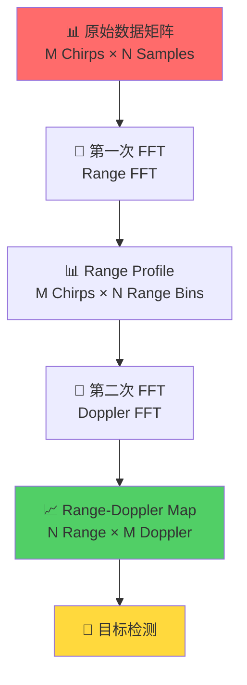
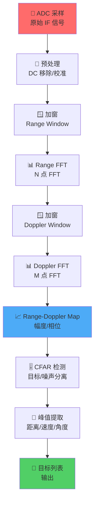

# 信号处理技术

!!! abstract "章节概述"
    信号处理是毫米波雷达系统的核心环节，它将原始的拍频信号转换为可用的距离-速度信息。本章将深入探讨 FMCW 雷达中使用的关键信号处理技术。

    📚 **本章学习路线**：

    1. 📊 理解一维 FFT 处理（Range FFT）
    2. 🎯 掌握二维 FFT 处理（2D-FFT）
    3. 🪟 学习窗函数的应用
    4. 🎚️ 理解 CFAR 恒虚警检测
    5. 🔊 掌握噪声抑制技术

    ⏱️ **预计时间**：50-60 分钟

!!! tip "前置知识"
    学习本章前建议先了解：

    - 📡 [FMCW 调制原理](fmcw.md)
    - 🌊 傅里叶变换基础
    - 📐 信号与系统基础
    - 📊 数字信号处理基础

---

## 🌊 从时域到频域：FFT 的魔力

### 为什么需要 FFT？

??? question "时域信号 vs 频域信号"
    === "⏱️ 时域信号"
        **原始拍频信号**：随时间变化的电压值

        ```python
        # 时域信号看起来像噪声
        Time: 0.001s -> Voltage: 0.523V
        Time: 0.002s -> Voltage: 0.891V
        Time: 0.003s -> Voltage: 0.234V
        ...
        ```

        **问题**：无法直接看出目标信息！❌

    === "📊 频域信号"
        **FFT 后的信号**：不同频率成分的幅度

        ```python
        # 频域信号显示峰值
        Frequency: 100kHz -> Amplitude: 0.05
        Frequency: 250kHz -> Amplitude: 0.85  ← 目标！
        Frequency: 500kHz -> Amplitude: 0.03
        ...
        ```

        **优势**：清晰显示目标位置！✅

!!! success "FFT 的核心作用"
    **将混乱的时域信号转换为清晰的频域信息！**

    - 🎯 **分离目标**：不同距离的目标对应不同频率
    - 📏 **提取距离**：频率 → 距离
    - 🔊 **抑制噪声**：信号能量集中在峰值

---

## 📏 一维 FFT：距离处理（Range FFT）

### 🎯 基本原理

Range FFT 对每个 chirp 的采样数据进行快速傅里叶变换，将拍频信号转换为距离信息。


### 数学表达

!!! info "Range FFT 公式"
    对于单个 chirp 的 $N$ 个采样点 $s[n]$（$n=0,1,...,N-1$）：

    $$
    S[k] = \sum_{n=0}^{N-1} s[n] \cdot w[n] \cdot e^{-j2\pi kn/N}
    $$

    **参数说明**：

    | 符号 | 参数名称 | 说明 |
    |------|----------|------|
    | $s[n]$ | 时域采样 | ADC 采样的拍频信号 |
    | $w[n]$ | 窗函数 | 用于抑制频谱泄漏 |
    | $S[k]$ | 频域结果 | 第 $k$ 个频率点的复数值 |
    | $N$ | FFT 点数 | 通常为 2 的幂次（256, 512, 1024...）|

### 距离分辨率

距离分辨率是雷达能够区分两个相邻目标的最小距离差：

$$
\boxed{\Delta R = \frac{c}{2B}}
$$

!!! example "距离分辨率计算示例"
    === "🚗 汽车雷达"
        **参数**：
        - 调频带宽 $B = 4$ GHz
        - 光速 $c = 3 \times 10^8$ m/s

        **距离分辨率**：
        $$
        \Delta R = \frac{3 \times 10^8}{2 \times 4 \times 10^9} = 0.0375 \text{ m} = 3.75 \text{ cm}
        $$

        ✅ **能够分辨相距 3.75 cm 以上的目标**

    === "📡 毫米波雷达"
        **参数**：
        - 调频带宽 $B = 1$ GHz
        - 光速 $c = 3 \times 10^8$ m/s

        **距离分辨率**：
        $$
        \Delta R = \frac{3 \times 10^8}{2 \times 1 \times 10^9} = 0.15 \text{ m} = 15 \text{ cm}
        $$

        ⚠️ **只能分辨相距 15 cm 以上的目标**

!!! warning "提升分辨率的方法"
    **想要更高的距离分辨率？**

    - 📈 **增加调频带宽** $B$
    - ❌ 但受到频谱分配限制
    - 💰 硬件成本增加

### FFT 点数选择

!!! tip "如何选择 FFT 点数？"
    === "📊 基本原则"
        **FFT 点数 $N$ 应满足**：

        1. **2 的幂次**：128, 256, 512, 1024, 2048...
           - 原因：FFT 算法效率最高

        2. **大于等于采样点数**：$N \geq N_{\text{samples}}$
           - 不足时进行零填充（Zero Padding）

        3. **权衡因素**：
           - ⬆️ 点数越大 → 频率分辨率越高 → 计算量越大
           - ⬇️ 点数越小 → 计算速度快 → 分辨率降低

    === "💻 实际选择"
        | 应用场景 | FFT 点数 | 说明 |
        |---------|---------|------|
        | 低成本雷达 | 256 | 实时性好，分辨率中等 |
        | 汽车雷达 | 512-1024 | 平衡性能和成本 |
        | 高性能雷达 | 2048-4096 | 高分辨率，高计算量 |

---

## 🎯 二维 FFT：距离-速度处理（2D-FFT）

### 原理概述

二维 FFT 是 FMCW 雷达信号处理的核心，它对多个 chirp 形成的数据矩阵进行两次 FFT 变换：

1. **Range FFT**（距离维）：每个 chirp 内的 FFT
2. **Doppler FFT**（速度维）：跨 chirp 的 FFT



### 数学表达

!!! info "2D-FFT 处理流程"
    **输入**：原始数据矩阵 $s[m, n]$
    - $m$：chirp 索引（$m = 0, 1, ..., M-1$）
    - $n$：采样点索引（$n = 0, 1, ..., N-1$）

    **第一步：Range FFT**（对每个 chirp）
    $$
    S_1[m, k] = \sum_{n=0}^{N-1} s[m, n] \cdot w_{\text{range}}[n] \cdot e^{-j2\pi kn/N}
    $$

    **第二步：Doppler FFT**（对每个距离单元）
    $$
    S_2[k, l] = \sum_{m=0}^{M-1} S_1[m, k] \cdot w_{\text{doppler}}[m] \cdot e^{-j2\pi lm/M}
    $$

    **输出**：Range-Doppler Map $S_2[k, l]$

### Range-Doppler Map 解读

!!! example "Range-Doppler Map 可视化"
    ```
    速度（m/s）
      ↑
      │      🔵        🔴
      │             ↗ 远离
    0 ├──────────────────────→ 距离（m）
      │    🟢     ↙ 接近
      │
    ```

    **图例说明**：
    - 🔴 **红色亮点**：高速远离目标
    - 🔵 **蓝色亮点**：中速远离目标
    - 🟢 **绿色亮点**：低速接近目标
    - **亮度**：目标反射强度（RCS）
    - **位置**：距离和速度坐标

### 速度分辨率

速度分辨率由 chirp 数量和帧时间决定：

$$
\boxed{\Delta v = \frac{\lambda}{2T_{\text{frame}}}}
$$

其中：
- $\lambda = c/f_c$：雷达工作波长
- $T_{\text{frame}} = M \cdot T_c$：帧持续时间
- $M$：chirp 数量
- $T_c$：单个 chirp 周期

!!! example "速度分辨率计算"
    **参数**：
    - 工作频率：$f_c = 77$ GHz
    - 波长：$\lambda = 3.9$ mm
    - chirp 数量：$M = 128$
    - chirp 周期：$T_c = 50$ μs
    - 帧时间：$T_{\text{frame}} = 128 \times 50 = 6.4$ ms

    **速度分辨率**：
    $$
    \Delta v = \frac{0.0039}{2 \times 0.0064} = 0.305 \text{ m/s} \approx 1.1 \text{ km/h}
    $$

---

## 🪟 窗函数：抑制频谱泄漏

### 什么是频谱泄漏？

!!! warning "频谱泄漏问题"
    当信号频率**不是** FFT 频率分辨率的整数倍时，信号能量会"泄漏"到相邻频率点，产生旁瓣。

    **影响**：
    - 📉 峰值幅度降低
    - 🔊 旁瓣抬高
    - 🎯 弱目标被淹没
    - 📏 测量精度下降

### 常用窗函数

!!! info "窗函数对比"
    === "🔲 矩形窗（Rectangle）"
        **定义**：
        $$
        w[n] = 1, \quad n = 0, 1, ..., N-1
        $$

        **特点**：
        - ✅ 主瓣最窄（最高频率分辨率）
        - ❌ 旁瓣最高（-13 dB）
        - **适用**：理想情况或测试

    === "🔺 汉宁窗（Hanning）"
        **定义**：
        $$
        w[n] = 0.5 - 0.5\cos\left(\frac{2\pi n}{N-1}\right)
        $$

        **特点**：
        - ✅ 旁瓣较低（-32 dB）
        - ⚠️ 主瓣展宽适中
        - **适用**：通用场景，最常用

    === "🔻 汉明窗（Hamming）"
        **定义**：
        $$
        w[n] = 0.54 - 0.46\cos\left(\frac{2\pi n}{N-1}\right)
        $$

        **特点**：
        - ✅ 旁瓣更低（-43 dB）
        - ⚠️ 主瓣稍宽
        - **适用**：需要抑制旁瓣的场景

    === "⬛ 布莱克曼窗（Blackman）"
        **定义**：
        $$
        w[n] = 0.42 - 0.5\cos\left(\frac{2\pi n}{N-1}\right) + 0.08\cos\left(\frac{4\pi n}{N-1}\right)
        $$

        **特点**：
        - ✅ 旁瓣极低（-58 dB）
        - ❌ 主瓣展宽明显
        - **适用**：高动态范围场景

### 窗函数性能对比

| 窗函数 | 主瓣宽度 | 旁瓣电平 | 幅度损失 | 推荐场景 |
|--------|----------|----------|----------|----------|
| 矩形 | 1.0 | -13 dB | 0 dB | 测试/理想 |
| 汉宁 | 1.5 | -32 dB | -1.4 dB | 通用场景 |
| 汉明 | 1.36 | -43 dB | -1.8 dB | 汽车雷达 |
| 布莱克曼 | 1.73 | -58 dB | -2.4 dB | 高精度 |

!!! tip "窗函数选择建议"
    **如何选择窗函数？**

    1. **通用场景**：使用 **汉宁窗**
       - 性能平衡，计算简单

    2. **强目标抑制**：使用 **汉明窗** 或 **布莱克曼窗**
       - 防止强目标旁瓣淹没弱目标

    3. **高分辨率需求**：使用 **矩形窗**
       - 牺牲旁瓣性能换取分辨率

---

## 🎚️ 恒虚警检测（CFAR）

### CFAR 的必要性

!!! question "为什么需要 CFAR？"
    **固定门限检测的问题**：

    ```
    固定门限 ────────────────────────
                🔵 目标    ❌ 噪声峰值
    ──────●─────●──────────●─────────
         噪声  目标  噪声  误报
    ```

    - ❌ 噪声电平变化时，误报率升高
    - ❌ 无法适应复杂环境
    - ❌ 强目标附近弱目标漏检

    **CFAR 的优势**：

    - ✅ 自适应调整门限
    - ✅ 保持恒定虚警率
    - ✅ 适应环境变化

### CA-CFAR 算法

!!! info "单元平均 CFAR（Cell-Averaging CFAR）"
    **原理**：使用周围单元的平均值估计噪声电平

    ```
    训练单元     保护单元   测试单元   保护单元     训练单元
    ├─────┬─────┼──┬──┬──┼────┼──┬──┬──┼─────┬─────┤
    │  ●  │  ●  │  │  │  │ 🎯 │  │  │  │  ●  │  ●  │
    └─────┴─────┴──┴──┴──┴────┴──┴──┴──┴─────┴─────┘
       N_train      N_guard  CUT  N_guard     N_train
    ```

    **算法步骤**：

    1. **计算噪声估计**：
       $$
       Z = \frac{1}{N_{\text{train}}} \sum_{\text{训练单元}} x_i
       $$

    2. **计算门限**：
       $$
       T = \alpha \cdot Z
       $$
       其中 $\alpha$ 是尺度因子，由期望虚警率 $P_{fa}$ 决定

    3. **目标判决**：
       $$
       \text{检测} = \begin{cases}
       1, & \text{if } x_{\text{CUT}} > T \\
       0, & \text{otherwise}
       \end{cases}
       $$

### 参数选择

!!! tip "CFAR 参数配置"
    === "📊 训练单元数"
        **典型值**：$N_{\text{train}} = 8 \sim 32$

        - ⬆️ 数量越多 → 噪声估计越准确 → 响应越慢
        - ⬇️ 数量越少 → 响应快 → 估计不稳定

        **推荐**：汽车雷达使用 16-24

    === "🛡️ 保护单元数"
        **典型值**：$N_{\text{guard}} = 2 \sim 4$

        **作用**：防止目标能量泄漏到噪声估计

        **选择**：约为目标主瓣宽度的一半

    === "🎯 虚警率"
        **典型值**：$P_{fa} = 10^{-6} \sim 10^{-4}$

        **影响**：
        - $P_{fa}$ 越小 → 门限越高 → 漏检增加
        - $P_{fa}$ 越大 → 门限越低 → 虚警增加

        **推荐**：$P_{fa} = 10^{-5}$

### 其他 CFAR 变体

!!! info "CFAR 算法家族"
    === "📈 GO-CFAR"
        **Greatest Of CFAR**

        - 使用左右窗口中较大的噪声估计
        - 适用于多目标场景
        - 防止邻近目标干扰

    === "📉 SO-CFAR"
        **Smallest Of CFAR**

        - 使用左右窗口中较小的噪声估计
        - 适用于杂波边缘
        - 降低虚警率

    === "🔄 OS-CFAR"
        **Ordered Statistic CFAR**

        - 对训练单元排序，选择第 k 大值
        - 抗干扰能力强
        - 适用于复杂环境

---

## 🔊 噪声与干扰抑制

### 噪声来源

!!! warning "雷达系统中的噪声"
    === "📡 热噪声"
        **来源**：接收机电路中电子的热运动

        **特点**：
        - 白噪声（功率谱均匀）
        - 功率正比于温度和带宽
        - 无法完全消除

        **描述**：
        $$
        P_n = k_B T_0 B \cdot NF
        $$
        - $k_B$：玻尔兹曼常数（$1.38 \times 10^{-23}$ J/K）
        - $T_0$：标准温度（290 K）
        - $B$：带宽
        - $NF$：噪声系数

    === "⚡ 相位噪声"
        **来源**：本振和 PLL 的相位抖动

        **影响**：
        - 降低距离分辨率
        - 增加测量误差
        - 影响弱目标检测

    === "🔌 ADC 量化噪声"
        **来源**：ADC 位数限制

        **信噪比**：
        $$
        \text{SNR}_{\text{ADC}} = 6.02 \times N_{\text{bits}} + 1.76 \text{ dB}
        $$

        **例如**：12-bit ADC → SNR ≈ 74 dB

### MTI 滤波器

!!! info "动目标指示（Moving Target Indication）"
    **目的**：抑制静止杂波，增强运动目标

    **实现**：对连续帧进行差分

    $$
    y[m] = s[m] - s[m-1]
    $$

    **效果**：
    - ✅ 静止目标被抑制
    - ✅ 运动目标保留
    - ✅ 提高检测概率

### 干扰抑制

!!! tip "干扰源与对策"
    | 干扰类型 | 来源 | 抑制方法 |
    |---------|------|---------|
    | 同频干扰 | 其他雷达 | 时分复用、频率捷变 |
    | RFI | 通信设备 | 频域滤波、时域门限 |
    | 发射泄漏 | TX-RX 耦合 | 隔离设计、自适应对消 |
    | 多径干扰 | 地面反射 | 仰角滤波、极化滤波 |

---

## 📊 信号处理流程总结

### 完整处理链



### 性能指标

!!! success "关键性能参数"
    | 参数 | 典型值 | 影响因素 |
    |------|--------|---------|
    | 距离分辨率 | 3-15 cm | 调频带宽 $B$ |
    | 速度分辨率 | 0.3-1 m/s | Chirp 数量和帧时间 |
    | 最大不模糊距离 | 100-300 m | 采样率和带宽 |
    | 最大不模糊速度 | ±30 m/s | Chirp 周期 |
    | 处理延迟 | 10-50 ms | FFT 点数和算法 |

---

## 💻 实践示例

### Python 实现：Range FFT

```python
import numpy as np
import matplotlib.pyplot as plt

# 参数设置
N = 256          # FFT 点数
fs = 5e6         # 采样率 5 MHz
f_beat = 100e3   # 拍频 100 kHz（对应某距离）

# 生成拍频信号
t = np.arange(N) / fs
signal = np.cos(2 * np.pi * f_beat * t) + 0.1 * np.random.randn(N)

# 加汉宁窗
window = np.hanning(N)
signal_windowed = signal * window

# FFT 处理
spectrum = np.fft.fft(signal_windowed, N)
spectrum_mag = np.abs(spectrum[:N//2])
freq_axis = np.fft.fftfreq(N, 1/fs)[:N//2]

# 转换为距离
c = 3e8          # 光速
B = 4e9          # 调频带宽 4 GHz
S = B / 50e-6    # 调频斜率
range_axis = freq_axis * c / (2 * S)

# 绘图
plt.figure(figsize=(12, 5))

plt.subplot(1, 2, 1)
plt.plot(t * 1e6, signal)
plt.xlabel('时间 (μs)')
plt.ylabel('幅度')
plt.title('拍频信号（时域）')
plt.grid(True)

plt.subplot(1, 2, 2)
plt.plot(range_axis, 20 * np.log10(spectrum_mag))
plt.xlabel('距离 (m)')
plt.ylabel('幅度 (dB)')
plt.title('Range Profile（频域）')
plt.grid(True)
plt.xlim([0, 50])

plt.tight_layout()
plt.show()
```

### Python 实现：2D-FFT

```python
import numpy as np
import matplotlib.pyplot as plt

# 参数设置
N = 256          # Range FFT 点数
M = 128          # Doppler FFT 点数（Chirp 数量）
fs = 5e6         # 采样率
Tc = 50e-6       # Chirp 周期
fc = 77e9        # 载波频率
c = 3e8          # 光速

# 目标参数
R1 = 10          # 目标 1 距离 10m
v1 = 5           # 目标 1 速度 5 m/s（接近）
R2 = 30          # 目标 2 距离 30m
v2 = -10         # 目标 2 速度 -10 m/s（远离）

# 计算拍频
B = 4e9
S = B / Tc
f_beat1 = 2 * S * R1 / c
f_doppler1 = 2 * v1 * fc / c
f_beat2 = 2 * S * R2 / c
f_doppler2 = 2 * v2 * fc / c

# 生成信号矩阵
data_matrix = np.zeros((M, N), dtype=complex)
for m in range(M):
    t = np.arange(N) / fs
    t_slow = m * Tc
    # 目标 1
    signal1 = np.exp(1j * 2 * np.pi * (f_beat1 * t + f_doppler1 * t_slow))
    # 目标 2
    signal2 = 0.5 * np.exp(1j * 2 * np.pi * (f_beat2 * t + f_doppler2 * t_slow))
    # 加噪声
    noise = 0.05 * (np.random.randn(N) + 1j * np.random.randn(N))
    data_matrix[m, :] = signal1 + signal2 + noise

# 2D-FFT 处理
# Range FFT
window_range = np.hanning(N)
data_range_fft = np.fft.fft(data_matrix * window_range, axis=1)

# Doppler FFT
window_doppler = np.hanning(M)
data_2d_fft = np.fft.fft(data_range_fft * window_doppler[:, np.newaxis], axis=0)

# FFT shift（将零频移到中心）
rd_map = np.fft.fftshift(data_2d_fft, axes=0)
rd_map_mag = np.abs(rd_map)

# 坐标轴
range_axis = np.arange(N) * c / (2 * S * fs / N)
doppler_axis = np.fft.fftshift(np.fft.fftfreq(M, Tc))
velocity_axis = doppler_axis * c / (2 * fc)

# 绘制 Range-Doppler Map
plt.figure(figsize=(10, 8))
plt.imshow(20 * np.log10(rd_map_mag + 1e-6),
           extent=[0, range_axis[-1], velocity_axis[0], velocity_axis[-1]],
           aspect='auto', cmap='jet', origin='lower')
plt.colorbar(label='幅度 (dB)')
plt.xlabel('距离 (m)')
plt.ylabel('速度 (m/s)')
plt.title('Range-Doppler Map')
plt.xlim([0, 50])
plt.ylim([-15, 15])
plt.grid(True, alpha=0.3)
plt.show()
```

### MATLAB 实现：CA-CFAR

```matlab
% CA-CFAR 检测示例
clear; clc;

% 生成测试信号
N = 1000;
noise = randn(1, N);
signal = noise;

% 添加目标
targets = [200, 500, 800];
SNR = [15, 10, 20];  % dB
for i = 1:length(targets)
    signal(targets(i)) = signal(targets(i)) + 10^(SNR(i)/20);
end

% CFAR 参数
N_train = 16;     % 训练单元数（单侧）
N_guard = 4;      % 保护单元数（单侧）
Pfa = 1e-4;       % 虚警率
alpha = N_train * (Pfa^(-1/N_train) - 1);  % 尺度因子

% CFAR 检测
threshold = zeros(1, N);
detection = zeros(1, N);

for i = (N_train + N_guard + 1):(N - N_train - N_guard)
    % 左侧训练单元
    left_cells = signal(i - N_train - N_guard : i - N_guard - 1);
    % 右侧训练单元
    right_cells = signal(i + N_guard + 1 : i + N_guard + N_train);

    % 噪声估计（CA-CFAR）
    noise_level = mean([left_cells, right_cells]);

    % 计算门限
    threshold(i) = alpha * noise_level;

    % 判决
    if signal(i) > threshold(i)
        detection(i) = 1;
    end
end

% 绘图
figure;
subplot(2,1,1);
plot(signal, 'b'); hold on;
plot(threshold, 'r--', 'LineWidth', 1.5);
legend('信号', 'CFAR 门限');
xlabel('单元索引');
ylabel('幅度');
title('CFAR 检测');
grid on;

subplot(2,1,2);
stem(find(detection), signal(detection == 1), 'r', 'filled');
xlabel('单元索引');
ylabel('幅度');
title('检测结果');
grid on;
```

---

## 🎓 本章小结

!!! success "关键要点"
    ✅ **FFT 是核心**：
    - Range FFT 提取距离信息
    - Doppler FFT 提取速度信息
    - 2D-FFT 生成 Range-Doppler Map

    ✅ **窗函数很重要**：
    - 抑制频谱泄漏
    - 改善动态范围
    - 汉宁窗最常用

    ✅ **CFAR 保证性能**：
    - 自适应门限
    - 恒定虚警率
    - CA-CFAR 最基本

    ✅ **噪声抑制必不可少**：
    - 热噪声、相位噪声、量化噪声
    - MTI 滤波器抑制静止杂波
    - 干扰抑制技术

---

## 📚 扩展阅读

!!! info "推荐资源"
    === "📖 教材"
        - **《雷达信号处理基础》** - Richards
        - **《数字信号处理》** - Oppenheim
        - **《毫米波雷达MIMO技术》** - Sturm

    === "📄 论文"
        - "CFAR Detection in Automotive Radar Systems"
        - "Window Functions and Their Application in Radar Signal Processing"
        - "Advanced Signal Processing for FMCW Radar"

    === "💻 工具"
        - **MATLAB Phased Array Toolbox**
        - **Python SciPy/NumPy**
        - **TI mmWave SDK**

---

## 📚 延伸学习

!!! info "相关章节"
    继续深入学习雷达信号处理和目标检测的相关内容：

| 主题 | 链接 | 内容简介 |
|------|------|---------|
| **FMCW 调制原理** | [fmcw.md](fmcw.md) | 回顾 FMCW 雷达的调制原理 |
| **目标检测算法** | [target-detection.md](target-detection.md) | 学习 CFAR 检测方法 |
| **IWR1443 硬件** | [../iwr1443/hardware.md](../iwr1443/hardware.md) | 了解 TI 雷达平台实现 |

---

!!! question "思考题"
    1. 为什么增加 FFT 点数可以提高频率分辨率，但不能提高距离分辨率？
    2. 在什么情况下应该选择布莱克曼窗而不是汉宁窗？
    3. CFAR 算法中，如何选择训练单元和保护单元的数量？
    4. 如何区分静止目标和运动目标？MTI 滤波器的原理是什么？
    5. Range-Doppler Map 中，如果有一个目标同时具有距离和速度，它会出现在哪个位置？

---

<div style="text-align: center; margin-top: 50px; padding: 20px; background: linear-gradient(135deg, #667eea 0%, #764ba2 100%); border-radius: 10px;">
    <h3 style="color: white; margin: 0;">🎯 准备好深入目标检测算法了吗？</h3>
    <p style="color: white; margin: 10px 0;">下一章我们将探讨如何从 Range-Doppler Map 中提取目标信息！</p>
    <a href="target-detection.md" style="display: inline-block; margin-top: 10px; padding: 10px 30px; background: white; color: #667eea; text-decoration: none; border-radius: 5px; font-weight: bold;">开始学习 →</a>
</div>
