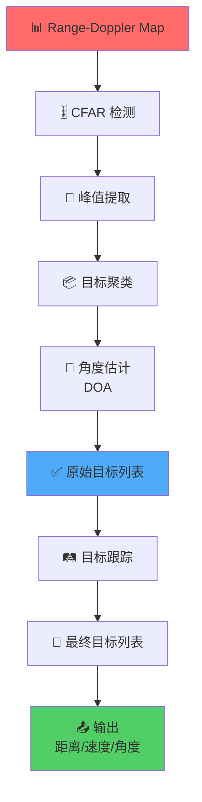

# 目标检测算法

!!! abstract "章节概述"
    目标检测是毫米波雷达信号处理的关键环节，它从 Range-Doppler Map 中识别真实目标，提取目标参数（距离、速度、角度、RCS），并建立目标跟踪。本章将深入探讨现代毫米波雷达中使用的主要目标检测算法。

    📚 **本章学习路线**：

    1. 🎯 理解目标检测的基本流程
    2. 🔍 掌握 CFAR 检测算法变体
    3. 📦 学习目标聚类方法
    4. 🛤️ 理解目标跟踪算法
    5. 📐 掌握角度估计技术（DOA）

    ⏱️ **预计时间**：60-70 分钟

!!! tip "前置知识"
    学习本章前建议先了解：

    - 📊 [信号处理技术](signal-processing.md)
    - 📡 [FMCW 调制原理](fmcw.md)
    - 📈 概率论与统计基础
    - 🔢 矩阵运算基础

---

## 🎯 目标检测流程概览

### 完整处理链



### 关键步骤说明

!!! info "各步骤作用"
    | 步骤 | 输入 | 输出 | 作用 |
    |------|------|------|------|
    | CFAR 检测 | Range-Doppler Map | 二值检测图 | 区分目标和噪声 |
    | 峰值提取 | 检测图 | 峰值位置列表 | 定位目标 |
    | 目标聚类 | 峰值列表 | 聚类后的目标 | 合并同一目标的多个检测点 |
    | 角度估计 | 多天线数据 | 角度信息 | 确定目标方位 |
    | 目标跟踪 | 当前帧目标 + 历史轨迹 | 跟踪轨迹 | 预测目标运动 |

---

## 🎚️ CFAR 检测算法详解

### CA-CFAR 回顾

!!! info "单元平均 CFAR（Cell-Averaging CFAR）"
    **基本原理**：使用周围单元的平均值估计噪声电平

    **优点**：
    - ✅ 实现简单
    - ✅ 计算量小
    - ✅ 均匀噪声环境性能好

    **缺点**：
    - ❌ 多目标环境性能下降
    - ❌ 杂波边缘虚警率高
    - ❌ 邻近目标互相遮蔽

### GO-CFAR 算法

!!! success "最大选择 CFAR（Greatest Of CFAR）"
    **原理**：选择左右窗口中较大的噪声估计值

    **算法**：
    $$
    Z_{\text{left}} = \frac{1}{N_{\text{train}}} \sum_{\text{左侧}} x_i
    $$
    $$
    Z_{\text{right}} = \frac{1}{N_{\text{train}}} \sum_{\text{右侧}} x_i
    $$
    $$
    Z = \max(Z_{\text{left}}, Z_{\text{right}})
    $$
    $$
    T = \alpha \cdot Z
    $$

    **优点**：
    - ✅ 多目标场景性能好
    - ✅ 减少邻近目标干扰
    - ✅ 虚警率稳定

    **缺点**：
    - ❌ 检测概率略有下降
    - ❌ 尺度因子需要调整

    **适用场景**：
    - 🚗 密集交通场景
    - 👥 多目标环境
    - 🏙️ 城市道路

### SO-CFAR 算法

!!! info "最小选择 CFAR（Smallest Of CFAR）"
    **原理**：选择左右窗口中较小的噪声估计值

    **算法**：
    $$
    Z = \min(Z_{\text{left}}, Z_{\text{right}})
    $$
    $$
    T = \alpha \cdot Z
    $$

    **优点**：
    - ✅ 杂波边缘性能好
    - ✅ 虚警率低
    - ✅ 适应非均匀背景

    **缺点**：
    - ❌ 检测概率降低
    - ❌ 弱目标容易漏检

    **适用场景**：
    - 🌳 杂波边缘
    - 🌊 非均匀环境
    - 📉 低虚警要求

### OS-CFAR 算法

!!! success "有序统计 CFAR（Ordered Statistic CFAR）"
    **原理**：对训练单元排序，选择第 k 大的值作为噪声估计

    **算法步骤**：

    1. **收集训练单元**：$\{x_1, x_2, ..., x_{2N_{\text{train}}}\}$

    2. **排序**：$x_{(1)} \leq x_{(2)} \leq ... \leq x_{(2N_{\text{train}})}$

    3. **选择第 k 大值**：
       $$
       Z = x_{(k)}
       $$
       其中 $k = \lfloor 0.75 \times 2N_{\text{train}} \rfloor$（典型值）

    4. **计算门限**：
       $$
       T = \alpha \cdot Z
       $$

    **参数选择**：

    | k 的选择 | 特性 | 适用场景 |
    |---------|------|---------|
    | $k = 0.5 \times 2N$ | 类似中值滤波 | 强干扰环境 |
    | $k = 0.75 \times 2N$ | 平衡性能 | 通用场景 |
    | $k = N$ | 类似 CA-CFAR | 均匀环境 |

    **优点**：
    - ✅ 抗干扰能力强
    - ✅ 多目标性能好
    - ✅ 适应各种环境

    **缺点**：
    - ❌ 计算量较大（需要排序）
    - ❌ 参数 k 需要调整

### 2D-CFAR

!!! warning "二维 CFAR"
    **动机**：Range-Doppler Map 是二维的，一维 CFAR 可能不够

    **方法**：

    === "📊 分离式 2D-CFAR"
        **步骤**：
        1. 对距离维进行 CFAR
        2. 对速度维进行 CFAR
        3. 取两者的交集

        **优点**：计算量小
        **缺点**：性能次优

    === "🔲 真正的 2D-CFAR"
        **步骤**：
        使用二维窗口进行噪声估计

        ```
        ┌─────────────────┐
        │  ● ● ● ● ● ● ●  │
        │  ● ┌─────┐ ●  │
        │  ● │     │ ●  │  训练单元
        │  ● │ 🎯  │ ●  │  测试单元
        │  ● │     │ ●  │  保护单元
        │  ● └─────┘ ●  │
        │  ● ● ● ● ● ● ●  │
        └─────────────────┘
        ```

        **优点**：性能最优
        **缺点**：计算量大

### CFAR 性能对比

!!! info "算法对比"
    | 算法 | 计算量 | 多目标 | 杂波边缘 | 均匀环境 | 推荐度 |
    |------|--------|--------|---------|---------|--------|
    | CA-CFAR | 低 | ⭐⭐ | ⭐⭐ | ⭐⭐⭐⭐⭐ | ⭐⭐⭐ |
    | GO-CFAR | 低 | ⭐⭐⭐⭐⭐ | ⭐⭐⭐ | ⭐⭐⭐⭐ | ⭐⭐⭐⭐ |
    | SO-CFAR | 低 | ⭐⭐ | ⭐⭐⭐⭐⭐ | ⭐⭐⭐ | ⭐⭐⭐ |
    | OS-CFAR | 中 | ⭐⭐⭐⭐ | ⭐⭐⭐⭐ | ⭐⭐⭐⭐ | ⭐⭐⭐⭐⭐ |
    | 2D-CFAR | 高 | ⭐⭐⭐⭐⭐ | ⭐⭐⭐⭐⭐ | ⭐⭐⭐⭐⭐ | ⭐⭐⭐⭐ |

---

## 📍 峰值提取与细化

### 简单峰值提取

!!! info "基本方法"
    **步骤**：

    1. **二值化**：CFAR 检测后得到二值图
       $$
       \text{Det}[i, j] = \begin{cases}
       1, & \text{if } S[i,j] > T[i,j] \\
       0, & \text{otherwise}
       \end{cases}
       $$

    2. **提取坐标**：找到所有检测点的坐标
       $$
       \text{Peaks} = \{(i, j) \mid \text{Det}[i, j] = 1\}
       $$

    3. **转换参数**：
       - 距离：$R[i] = i \cdot \Delta R$
       - 速度：$v[j] = (j - M/2) \cdot \Delta v$
       - 幅度：$A[i,j] = S[i,j]$

### 峰值细化（Peak Refinement）

!!! success "提高测量精度"
    **问题**：FFT 的频率分辨率有限，峰值可能不在 FFT bin 的中心

    **解决方案**：插值细化

    === "📐 抛物线插值"
        **原理**：使用峰值点及其邻近点拟合抛物线

        **公式**：对于峰值位置 $k$：
        $$
        \delta = \frac{1}{2} \cdot \frac{|S[k+1]| - |S[k-1]|}{2|S[k]| - |S[k+1]| - |S[k-1]|}
        $$

        **细化后的位置**：
        $$
        k_{\text{refined}} = k + \delta
        $$

        **精度提升**：从 FFT bin 精度提升到约 1/10 bin

    === "📊 质心法"
        **原理**：使用加权平均

        **公式**：
        $$
        k_{\text{refined}} = \frac{\sum_{i=k-1}^{k+1} i \cdot |S[i]|}{\sum_{i=k-1}^{k+1} |S[i]|}
        $$

        **优点**：简单，噪声鲁棒性好
        **缺点**：精度略低于抛物线插值

### 多峰合并

!!! warning "处理相邻峰值"
    **问题**：同一目标可能产生多个相邻的检测点

    **解决方案**：

    1. **局部最大值抑制（NMS）**：
       - 在 3×3 或 5×5 窗口内
       - 只保留最大值
       - 抑制邻近的次大值

    2. **峰值合并**：
       - 距离 < 阈值的峰值
       - 合并为一个目标
       - 使用加权平均计算最终位置

---

## 📦 目标聚类

### 为什么需要聚类？

!!! question "聚类的必要性"
    **问题**：
    - 📡 同一目标可能在多个距离-速度单元被检测
    - 🚗 大型目标产生多个散射点
    - 📊 需要将属于同一目标的检测点归为一类

    **目标**：
    - 🎯 合并同一目标的多个检测点
    - 📍 估计目标的中心位置
    - 📏 估计目标的尺寸和形状

### DBSCAN 聚类

!!! success "基于密度的聚类算法"
    **原理**：根据点的密度进行聚类，不需要预先指定簇数量

    **关键参数**：
    - $\epsilon$：邻域半径
    - $\text{MinPts}$：最小点数（通常设为 3-5）

    **点的类型**：

    ```mermaid
    graph LR
        A[核心点<br/>Core Point] --> B[边界点<br/>Border Point]
        B --> C[噪声点<br/>Noise Point]

        style A fill:#51cf66
        style B fill:#ffd93d
        style C fill:#ff6b6b
    ```

    - **核心点**：$\epsilon$ 邻域内至少有 $\text{MinPts}$ 个点
    - **边界点**：在核心点的 $\epsilon$ 邻域内，但自己不是核心点
    - **噪声点**：既不是核心点也不是边界点

    **算法步骤**：

    1. **初始化**：所有点标记为未访问
    2. **遍历每个点**：
       - 如果已访问，跳过
       - 找到该点 $\epsilon$ 邻域内的所有点
       - 如果邻域内点数 ≥ MinPts：
         * 创建新簇
         * 扩展簇（递归添加邻域点）
       - 否则标记为噪声点
    3. **输出**：所有簇和噪声点

### K-Means 聚类

!!! info "经典聚类算法"
    **原理**：将点分配到 k 个簇，使簇内距离最小

    **算法步骤**：

    1. **初始化**：随机选择 k 个中心点
    2. **分配**：将每个点分配到最近的中心
    3. **更新**：重新计算每个簇的中心
    4. **迭代**：重复步骤 2-3 直到收敛

    **优点**：
    - ✅ 简单高效
    - ✅ 适合球形簇

    **缺点**：
    - ❌ 需要预先指定 k
    - ❌ 对初始化敏感
    - ❌ 对噪声敏感

### 距离度量

!!! tip "聚类中的距离定义"
    **欧几里得距离**（最常用）：
    $$
    d = \sqrt{(\Delta R)^2 + (\Delta v)^2}
    $$

    **归一化距离**：
    $$
    d = \sqrt{\left(\frac{\Delta R}{\sigma_R}\right)^2 + \left(\frac{\Delta v}{\sigma_v}\right)^2}
    $$
    其中 $\sigma_R$、$\sigma_v$ 是距离和速度的标准差

    **马氏距离**：
    $$
    d = \sqrt{(\mathbf{x}_1 - \mathbf{x}_2)^T \Sigma^{-1} (\mathbf{x}_1 - \mathbf{x}_2)}
    $$
    其中 $\Sigma$ 是协方差矩阵

### 聚类参数选择

!!! warning "参数调优"
    === "📏 邻域半径 $\epsilon$"
        **选择原则**：
        - 基于距离和速度分辨率
        - 典型值：$\epsilon = 2 \sim 3$ 倍分辨率

        **示例**：
        - 距离分辨率：$\Delta R = 0.04$ m
        - 速度分辨率：$\Delta v = 0.3$ m/s
        - $\epsilon_R = 0.1$ m，$\epsilon_v = 0.9$ m/s

    === "🔢 最小点数 MinPts"
        **选择原则**：
        - 根据目标大小和雷达分辨率
        - 典型值：3-5

        **权衡**：
        - 过小 → 噪声点被误认为目标
        - 过大 → 小目标被忽略

---

## 📐 角度估计（DOA）

### MIMO 雷达基础

!!! info "MIMO 原理"
    **多输入多输出（MIMO）雷达**：
    - 📡 多个发射天线（Tx）
    - 📡 多个接收天线（Rx）
    - 📊 形成虚拟阵列（Virtual Array）

    **虚拟阵列**：
    $$
    N_{\text{virtual}} = N_{\text{Tx}} \times N_{\text{Rx}}
    $$

    **例如**：TI IWR1443
    - 3 个 Tx
    - 4 个 Rx
    - 12 个虚拟天线

### 波束成形（Beamforming）

!!! success "经典 DOA 方法"
    **原理**：通过相位控制，将天线阵列的增益指向特定方向

    **数学模型**：
    对于角度 $\theta$ 的目标，第 $n$ 个天线接收的信号：
    $$
    x_n = A \cdot e^{j 2\pi \frac{d}{\lambda} n \sin\theta}
    $$

    **波束成形权重**：
    $$
    w_n(\theta) = e^{-j 2\pi \frac{d}{\lambda} n \sin\theta}
    $$

    **输出功率**：
    $$
    P(\theta) = \left| \sum_{n=0}^{N-1} w_n(\theta) \cdot x_n \right|^2
    $$

    **角度估计**：
    $$
    \hat{\theta} = \arg\max_{\theta} P(\theta)
    $$

### FFT-Based DOA

!!! info "基于 FFT 的角度估计"
    **原理**：对虚拟天线阵列进行 FFT，直接得到角度谱

    **算法**：

    1. **排列数据**：将虚拟天线数据排列成向量
       $$
       \mathbf{x} = [x_0, x_1, ..., x_{N-1}]^T
       $$

    2. **加窗**：减少旁瓣
       $$
       \mathbf{x}_w = \mathbf{x} \odot \mathbf{w}
       $$

    3. **FFT**：
       $$
       \mathbf{X} = \text{FFT}(\mathbf{x}_w)
       $$

    4. **角度映射**：
       $$
       \theta[k] = \arcsin\left(\frac{k \lambda}{N d}\right)
       $$

    **优点**：
    - ✅ 计算快速
    - ✅ 实现简单
    - ✅ 实时性好

    **缺点**：
    - ❌ 角度分辨率受限于天线数量
    - ❌ 多目标分辨能力有限

### 角度分辨率

角度分辨率由虚拟天线阵列的孔径决定：

$$
\boxed{\Delta\theta = \frac{\lambda}{L} = \frac{\lambda}{(N-1) \cdot d}}
$$

其中：
- $\lambda$：波长
- $L$：阵列孔径
- $N$：虚拟天线数量
- $d$：天线间距

!!! example "角度分辨率计算"
    **参数**：
    - 频率：77 GHz
    - 波长：$\lambda = 3.9$ mm
    - 天线数量：$N = 12$
    - 天线间距：$d = \lambda/2 = 1.95$ mm
    - 阵列孔径：$L = 11 \times 1.95 = 21.45$ mm

    **角度分辨率**：
    $$
    \Delta\theta = \frac{3.9}{21.45} = 0.182 \text{ rad} = 10.4°
    $$

### MUSIC 算法

!!! success "超分辨率角度估计"
    **多重信号分类（MUltiple SIgnal Classification）**

    **原理**：利用信号子空间和噪声子空间的正交性

    **算法步骤**：

    1. **计算协方差矩阵**：
       $$
       \mathbf{R} = \frac{1}{M} \sum_{m=1}^{M} \mathbf{x}_m \mathbf{x}_m^H
       $$

    2. **特征值分解**：
       $$
       \mathbf{R} = \mathbf{U}_s \mathbf{\Lambda}_s \mathbf{U}_s^H + \mathbf{U}_n \mathbf{\Lambda}_n \mathbf{U}_n^H
       $$
       - $\mathbf{U}_s$：信号子空间
       - $\mathbf{U}_n$：噪声子空间

    3. **MUSIC 谱**：
       $$
       P_{\text{MUSIC}}(\theta) = \frac{1}{\mathbf{a}(\theta)^H \mathbf{U}_n \mathbf{U}_n^H \mathbf{a}(\theta)}
       $$
       其中 $\mathbf{a}(\theta)$ 是导向矢量

    4. **峰值搜索**：找到 $P_{\text{MUSIC}}(\theta)$ 的峰值

    **优点**：
    - ✅ 超分辨率（角度分辨率不受天线数限制）
    - ✅ 多目标分辨能力强
    - ✅ 精度高

    **缺点**：
    - ❌ 计算量大（特征值分解）
    - ❌ 需要知道目标数量
    - ❌ 对噪声敏感

---

## 🛤️ 目标跟踪

### 为什么需要跟踪？

!!! question "跟踪的必要性"
    **单帧检测的问题**：
    - 📉 检测概率 < 100%（可能漏检）
    - 🔊 虚警存在（噪声误报）
    - 📊 测量有噪声（抖动）
    - ❓ 无法预测目标运动

    **跟踪的优势**：
    - ✅ 关联多帧数据，提高可靠性
    - ✅ 滤除虚警
    - ✅ 平滑测量噪声
    - ✅ 预测目标位置
    - ✅ 估计目标加速度

### 卡尔曼滤波器

!!! success "最优线性滤波器"
    **状态空间模型**：

    **预测方程**（运动模型）：
    $$
    \mathbf{x}_{k|k-1} = \mathbf{F} \mathbf{x}_{k-1|k-1} + \mathbf{B} \mathbf{u}_k + \mathbf{w}_k
    $$

    **观测方程**（测量模型）：
    $$
    \mathbf{z}_k = \mathbf{H} \mathbf{x}_k + \mathbf{v}_k
    $$

    **符号说明**：
    - $\mathbf{x}_k$：状态向量（位置、速度等）
    - $\mathbf{z}_k$：测量向量（雷达观测）
    - $\mathbf{F}$：状态转移矩阵
    - $\mathbf{H}$：观测矩阵
    - $\mathbf{w}_k$：过程噪声
    - $\mathbf{v}_k$：测量噪声

### 卡尔曼滤波步骤

!!! info "两步递归"
    === "📊 预测步骤"
        **状态预测**：
        $$
        \hat{\mathbf{x}}_{k|k-1} = \mathbf{F} \hat{\mathbf{x}}_{k-1|k-1}
        $$

        **协方差预测**：
        $$
        \mathbf{P}_{k|k-1} = \mathbf{F} \mathbf{P}_{k-1|k-1} \mathbf{F}^T + \mathbf{Q}
        $$

    === "📈 更新步骤"
        **卡尔曼增益**：
        $$
        \mathbf{K}_k = \mathbf{P}_{k|k-1} \mathbf{H}^T (\mathbf{H} \mathbf{P}_{k|k-1} \mathbf{H}^T + \mathbf{R})^{-1}
        $$

        **状态更新**：
        $$
        \hat{\mathbf{x}}_{k|k} = \hat{\mathbf{x}}_{k|k-1} + \mathbf{K}_k (\mathbf{z}_k - \mathbf{H} \hat{\mathbf{x}}_{k|k-1})
        $$

        **协方差更新**：
        $$
        \mathbf{P}_{k|k} = (\mathbf{I} - \mathbf{K}_k \mathbf{H}) \mathbf{P}_{k|k-1}
        $$

### 运动模型

!!! tip "常用运动模型"
    === "🚗 恒速模型（CV）"
        **状态向量**：
        $$
        \mathbf{x} = [x, \dot{x}, y, \dot{y}]^T
        $$

        **状态转移矩阵**：
        $$
        \mathbf{F} = \begin{bmatrix}
        1 & \Delta t & 0 & 0 \\
        0 & 1 & 0 & 0 \\
        0 & 0 & 1 & \Delta t \\
        0 & 0 & 0 & 1
        \end{bmatrix}
        $$

        **适用**：匀速直线运动

    === "🏎️ 恒加速模型（CA）"
        **状态向量**：
        $$
        \mathbf{x} = [x, \dot{x}, \ddot{x}, y, \dot{y}, \ddot{y}]^T
        $$

        **状态转移矩阵**：
        $$
        \mathbf{F} = \begin{bmatrix}
        1 & \Delta t & \frac{\Delta t^2}{2} & 0 & 0 & 0 \\
        0 & 1 & \Delta t & 0 & 0 & 0 \\
        0 & 0 & 1 & 0 & 0 & 0 \\
        0 & 0 & 0 & 1 & \Delta t & \frac{\Delta t^2}{2} \\
        0 & 0 & 0 & 0 & 1 & \Delta t \\
        0 & 0 & 0 & 0 & 0 & 1
        \end{bmatrix}
        $$

        **适用**：加速/减速运动

    === "🔄 转弯模型（CT）"
        **状态向量**：
        $$
        \mathbf{x} = [x, \dot{x}, y, \dot{y}, \omega]^T
        $$
        其中 $\omega$ 是角速度

        **适用**：车辆转弯

### 数据关联

!!! warning "多目标跟踪的关键问题"
    **问题**：如何将当前帧的观测与已有轨迹关联？

    ```
    轨迹 A ──→ 🚗        观测 1 ──→ 🚙
    轨迹 B ──→ 🚙        观测 2 ──→ 🚗
    轨迹 C ──→ 🚕        观测 3 ──→ 🚕

    如何关联？
    ```

    **方法**：

    === "📏 最近邻（NN）"
        **原理**：选择距离最近的观测

        **算法**：
        1. 计算每个轨迹与每个观测的距离
        2. 选择距离最小的配对
        3. 未匹配的观测 → 新轨迹
        4. 未匹配的轨迹 → 保持预测

        **优点**：简单快速
        **缺点**：容易出错

    === "🎯 全局最优（GNN）"
        **原理**：全局最小化总匹配距离

        **算法**：使用匈牙利算法

        **优点**：全局最优
        **缺点**：计算量大

    === "🔢 联合概率数据关联（JPDA）"
        **原理**：考虑所有可能的关联，计算概率

        **优点**：密集环境性能好
        **缺点**：计算复杂

### 轨迹管理

!!! info "轨迹生命周期"
    ```mermaid
    stateDiagram-v2
        [*] --> 临时: 新检测
        临时 --> 确认: 连续检测 N 次
        临时 --> [*]: 长时间未检测
        确认 --> 跟踪: 持续检测
        跟踪 --> 确认: 偶尔漏检
        确认 --> 删除: 连续漏检 M 次
        删除 --> [*]
    ```

    **参数设置**：
    - **确认阈值 N**：典型值 3-5 帧
    - **删除阈值 M**：典型值 5-10 帧
    - **最大漏检数**：允许的连续漏检次数

---

## 💻 实践示例

### Python 实现：OS-CFAR

```python
import numpy as np

def os_cfar(signal, N_train=16, N_guard=4, k_percentile=0.75, Pfa=1e-4):
    """
    有序统计 CFAR 检测

    参数:
        signal: 输入信号（1D）
        N_train: 训练单元数（单侧）
        N_guard: 保护单元数（单侧）
        k_percentile: OS-CFAR 百分位（0-1）
        Pfa: 虚警率

    返回:
        detection: 检测结果（二值）
        threshold: 门限值
    """
    N = len(signal)
    detection = np.zeros(N, dtype=bool)
    threshold = np.zeros(N)

    # 计算尺度因子
    N_total = 2 * N_train
    k = int(k_percentile * N_total)
    alpha = N_total * (Pfa**(-1/N_total) - 1)

    for i in range(N_train + N_guard, N - N_train - N_guard):
        # 收集训练单元
        left_cells = signal[i - N_train - N_guard : i - N_guard]
        right_cells = signal[i + N_guard + 1 : i + N_guard + N_train + 1]
        train_cells = np.concatenate([left_cells, right_cells])

        # 排序并选择第 k 大值
        sorted_cells = np.sort(train_cells)
        noise_estimate = sorted_cells[k]

        # 计算门限
        threshold[i] = alpha * noise_estimate

        # 判决
        if signal[i] > threshold[i]:
            detection[i] = True

    return detection, threshold


# 测试
N = 1000
signal = np.random.randn(N) ** 2  # 瑞利分布（功率）
signal[200] = 10  # 强目标
signal[500] = 5   # 中等目标
signal[800] = 3   # 弱目标

detection, threshold = os_cfar(signal, N_train=16, N_guard=4, Pfa=1e-4)

import matplotlib.pyplot as plt
plt.figure(figsize=(12, 6))
plt.plot(signal, 'b', label='信号')
plt.plot(threshold, 'r--', linewidth=2, label='OS-CFAR 门限')
plt.stem(np.where(detection)[0], signal[detection], 'g',
         markerfmt='go', label='检测目标')
plt.xlabel('单元索引')
plt.ylabel('功率')
plt.title('OS-CFAR 检测示例')
plt.legend()
plt.grid(True)
plt.show()
```

### Python 实现：DBSCAN 聚类

```python
from sklearn.cluster import DBSCAN
import numpy as np
import matplotlib.pyplot as plt

# 生成模拟检测点
np.random.seed(42)

# 目标 1：中心 (10, 5)
target1 = np.random.randn(15, 2) * [[0.1, 0.3]] + [10, 5]

# 目标 2：中心 (20, -3)
target2 = np.random.randn(12, 2) * [[0.15, 0.4]] + [20, -3]

# 目标 3：中心 (30, 2)
target3 = np.random.randn(10, 2) * [[0.12, 0.35]] + [30, 2]

# 噪声点
noise = np.random.rand(5, 2) * [[40, 20]] - [0, 10]

# 合并所有点
detections = np.vstack([target1, target2, target3, noise])

# DBSCAN 聚类
eps_range = 0.8      # 距离分辨率的 2 倍
eps_doppler = 1.5    # 速度分辨率的 2 倍

# 归一化距离度量
X_scaled = detections.copy()
X_scaled[:, 0] = detections[:, 0] / eps_range
X_scaled[:, 1] = detections[:, 1] / eps_doppler

dbscan = DBSCAN(eps=1.0, min_samples=3)
labels = dbscan.fit_predict(X_scaled)

# 绘图
plt.figure(figsize=(12, 8))
unique_labels = set(labels)
colors = plt.cm.rainbow(np.linspace(0, 1, len(unique_labels)))

for label, color in zip(unique_labels, colors):
    if label == -1:
        # 噪声点（黑色）
        color = 'k'
        marker = 'x'
    else:
        marker = 'o'

    class_members = labels == label
    xy = detections[class_members]
    plt.scatter(xy[:, 0], xy[:, 1], c=[color], marker=marker,
                s=100, alpha=0.6, edgecolors='black', linewidth=1.5,
                label=f'簇 {label}' if label != -1 else '噪声')

# 计算并绘制簇中心
for label in unique_labels:
    if label != -1:
        class_members = labels == label
        xy = detections[class_members]
        center = xy.mean(axis=0)
        plt.scatter(center[0], center[1], c='red', marker='*',
                   s=500, edgecolors='black', linewidth=2,
                   label=f'中心 {label}')

plt.xlabel('距离 (m)')
plt.ylabel('速度 (m/s)')
plt.title('DBSCAN 目标聚类')
plt.legend()
plt.grid(True, alpha=0.3)
plt.show()

print(f'检测到 {len(unique_labels) - (1 if -1 in labels else 0)} 个目标')
```

### Python 实现：卡尔曼滤波跟踪

```python
import numpy as np
import matplotlib.pyplot as plt

class KalmanFilter:
    """恒速模型卡尔曼滤波器"""
    def __init__(self, dt=0.1):
        self.dt = dt

        # 状态向量 [x, vx, y, vy]
        self.x = np.zeros(4)

        # 状态转移矩阵
        self.F = np.array([
            [1, dt, 0, 0],
            [0, 1, 0, 0],
            [0, 0, 1, dt],
            [0, 0, 0, 1]
        ])

        # 观测矩阵（测量位置）
        self.H = np.array([
            [1, 0, 0, 0],
            [0, 0, 1, 0]
        ])

        # 过程噪声协方差
        q = 0.1
        self.Q = np.array([
            [dt**4/4, dt**3/2, 0, 0],
            [dt**3/2, dt**2, 0, 0],
            [0, 0, dt**4/4, dt**3/2],
            [0, 0, dt**3/2, dt**2]
        ]) * q**2

        # 测量噪声协方差
        r = 0.5
        self.R = np.eye(2) * r**2

        # 状态协方差
        self.P = np.eye(4) * 100

    def predict(self):
        """预测步骤"""
        self.x = self.F @ self.x
        self.P = self.F @ self.P @ self.F.T + self.Q
        return self.x[:2]  # 返回位置预测

    def update(self, z):
        """更新步骤"""
        # 创新（残差）
        y = z - self.H @ self.x

        # 创新协方差
        S = self.H @ self.P @ self.H.T + self.R

        # 卡尔曼增益
        K = self.P @ self.H.T @ np.linalg.inv(S)

        # 更新状态
        self.x = self.x + K @ y

        # 更新协方差
        self.P = (np.eye(4) - K @ self.H) @ self.P

        return self.x[:2]  # 返回位置估计


# 生成真实轨迹（曲线运动）
np.random.seed(42)
N = 100
dt = 0.1
t = np.arange(N) * dt

true_x = 10 * t
true_y = 5 * np.sin(0.5 * t)
true_traj = np.column_stack([true_x, true_y])

# 添加测量噪声
meas_noise = np.random.randn(N, 2) * 0.5
measurements = true_traj + meas_noise

# 卡尔曼滤波
kf = KalmanFilter(dt=dt)
kf.x = np.array([measurements[0, 0], 0, measurements[0, 1], 0])  # 初始化

estimates = []
predictions = []

for i in range(N):
    # 预测
    pred = kf.predict()
    predictions.append(pred)

    # 更新
    est = kf.update(measurements[i])
    estimates.append(est)

estimates = np.array(estimates)
predictions = np.array(predictions)

# 绘图
plt.figure(figsize=(14, 10))

# 轨迹对比
plt.subplot(2, 2, 1)
plt.plot(true_traj[:, 0], true_traj[:, 1], 'g-', linewidth=2, label='真实轨迹')
plt.plot(measurements[:, 0], measurements[:, 1], 'r.', alpha=0.5, label='测量值')
plt.plot(estimates[:, 0], estimates[:, 1], 'b-', linewidth=2, label='KF 估计')
plt.xlabel('X (m)')
plt.ylabel('Y (m)')
plt.title('卡尔曼滤波跟踪')
plt.legend()
plt.grid(True)
plt.axis('equal')

# X 方向误差
plt.subplot(2, 2, 2)
meas_error_x = measurements[:, 0] - true_traj[:, 0]
est_error_x = estimates[:, 0] - true_traj[:, 0]
plt.plot(t, meas_error_x, 'r-', alpha=0.5, label='测量误差')
plt.plot(t, est_error_x, 'b-', linewidth=2, label='估计误差')
plt.xlabel('时间 (s)')
plt.ylabel('X 误差 (m)')
plt.title('X 方向误差')
plt.legend()
plt.grid(True)

# Y 方向误差
plt.subplot(2, 2, 3)
meas_error_y = measurements[:, 1] - true_traj[:, 1]
est_error_y = estimates[:, 1] - true_traj[:, 1]
plt.plot(t, meas_error_y, 'r-', alpha=0.5, label='测量误差')
plt.plot(t, est_error_y, 'b-', linewidth=2, label='估计误差')
plt.xlabel('时间 (s)')
plt.ylabel('Y 误差 (m)')
plt.title('Y 方向误差')
plt.legend()
plt.grid(True)

# RMSE 对比
plt.subplot(2, 2, 4)
meas_rmse = np.sqrt(np.cumsum(meas_error_x**2 + meas_error_y**2) / np.arange(1, N+1))
est_rmse = np.sqrt(np.cumsum(est_error_x**2 + est_error_y**2) / np.arange(1, N+1))
plt.plot(t, meas_rmse, 'r-', linewidth=2, label='测量 RMSE')
plt.plot(t, est_rmse, 'b-', linewidth=2, label='估计 RMSE')
plt.xlabel('时间 (s)')
plt.ylabel('RMSE (m)')
plt.title('累积均方根误差')
plt.legend()
plt.grid(True)

plt.tight_layout()
plt.show()

print(f'测量平均 RMSE: {meas_rmse[-1]:.3f} m')
print(f'估计平均 RMSE: {est_rmse[-1]:.3f} m')
print(f'改善比例: {(1 - est_rmse[-1]/meas_rmse[-1])*100:.1f}%')
```

---

## 🎓 本章小结

!!! success "关键要点"
    ✅ **CFAR 检测是基础**：
    - CA-CFAR、GO-CFAR、SO-CFAR、OS-CFAR
    - 根据场景选择合适的算法
    - 参数调优很重要

    ✅ **聚类合并检测点**：
    - DBSCAN 最常用
    - 参数选择基于分辨率
    - 噪声点自动过滤

    ✅ **角度估计提供方位**：
    - FFT-Based DOA 快速简单
    - MUSIC 算法超分辨率
    - MIMO 增加虚拟天线数

    ✅ **跟踪提高可靠性**：
    - 卡尔曼滤波平滑噪声
    - 数据关联关键
    - 轨迹管理必不可少

---

## 📚 扩展阅读

!!! info "推荐资源"
    === "📖 教材"
        - **《Radar Target Detection》** - Meyer & Hinz
        - **《Multiple-Target Tracking with Radar Applications》** - Blackman
        - **《Array Signal Processing》** - Van Trees

    === "📄 论文"
        - "CFAR Detection of Multiple Targets in Automotive Radar"
        - "DBSCAN Clustering for Radar Point Cloud Processing"
        - "Kalman Filter Based Multi-Target Tracking in mmWave Radar"

    === "💻 工具"
        - **TI mmWave SDK** - 完整的检测和跟踪模块
        - **Python scikit-learn** - 机器学习聚类算法
        - **MATLAB Sensor Fusion Toolbox** - 多传感器融合

---

## 📚 延伸学习

!!! info "相关章节"
    继续深入学习雷达技术的相关内容：

| 主题 | 链接 | 内容简介 |
|------|------|---------|
| **信号处理技术** | [signal-processing.md](signal-processing.md) | 回顾 FMCW 雷达信号处理算法 |
| **FMCW 调制原理** | [fmcw.md](fmcw.md) | 回顾 FMCW 雷达的调制原理 |
| **IWR1443 硬件** | [../iwr1443/hardware.md](../iwr1443/hardware.md) | 了解 TI 雷达平台实现 |

---

!!! question "思考题"
    1. 在多目标密集场景下，为什么 GO-CFAR 比 CA-CFAR 性能更好？
    2. DBSCAN 聚类中，如何根据雷达参数选择 $\epsilon$ 和 MinPts？
    3. 为什么 MUSIC 算法能实现超分辨率角度估计？它的局限性是什么？
    4. 卡尔曼滤波器中，过程噪声协方差 Q 和测量噪声协方差 R 如何选择？
    5. 在什么情况下应该使用扩展卡尔曼滤波（EKF）而不是标准卡尔曼滤波？

---

<div style="text-align: center; margin-top: 50px; padding: 20px; background: linear-gradient(135deg, #667eea 0%, #764ba2 100%); border-radius: 10px;">
    <h3 style="color: white; margin: 0;">🎉 恭喜！你已掌握目标检测核心技术</h3>
    <p style="color: white; margin: 10px 0;">从信号处理到目标检测，你已经建立了完整的毫米波雷达知识体系！</p>
    <a href="../index.md" style="display: inline-block; margin-top: 10px; padding: 10px 30px; background: white; color: #667eea; text-decoration: none; border-radius: 5px; font-weight: bold;">返回主页 →</a>
</div>
