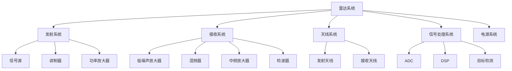

# 雷达原理概述

## 什么是雷达？

!!! info "雷达的定义"
    雷达（**RADAR**）是 **RA**dio **D**etection **A**nd **R**anging 的缩写，意为“**无线电探测和测距**”。雷达是一种利用电磁波探测目标的电子设备。

### 🎯 雷达的基本功能

-   :material-magnify:{ .lg } **探测**

    ---

    发现感兴趣区域内的目标

-   :material-crosshairs-gps:{ .lg } **定位**

    ---

    确定目标的位置
    （距离、方位、高度）

-   :material-speedometer:{ .lg } **测速**

    ---

    测量目标的运动速度

-   :material-radar:{ .lg } **识别**

    ---

    识别目标的特性和类型

## 雷达的工作原理

### 🔄 基本原理

雷达通过发射电磁波并接收目标反射回来的回波来工作。基本过程如下：

*图：雷达的发射和接收基本原理*

!!! abstract "工作流程"
    1. **发射** → 雷达发射器产生电磁波信号并通过天线发射出去
    2. **传播** → 电磁波以光速在空间中传播
    3. **反射** → 电磁波遇到目标后发生反射
    4. **接收** → 雷达接收器接收反射回来的回波信号
    5. **处理** → 对接收到的信号进行处理，提取目标信息

### 📏 距离测量

距离测量是雷达最基本的功能。根据电磁波传播的时间差来计算距离：

!!! note "距离计算公式"
    $$
    R = \frac{c \cdot \Delta t}{2}
    $$

    **参数说明**：

    | 符号 | 含义 | 数值 |
    |------|------|------|
    | $R$ | 目标距离 | - |
    | $c$ | 光速 | $3 \times 10^8$ m/s |
    | $\Delta t$ | 往返时间差 | - |

    !!! warning "注意"
        公式中除以 2 是因为电磁波往返经过了两倍的距离！

## 雷达的分类

### 按工作方式分类

#### 1. 脉冲雷达

- **特点**：间歇发射脉冲信号
- **优点**：峰值功率高，作用距离远
- **应用**：远程探测、空中交通管制

#### 2. 连续波雷达 (CW)

- **特点**：连续发射电磁波
- **优点**：结构简单，易于测速
- **缺点**：难以同时测距和测速
- **应用**：测速雷达、近程探测

#### 3. 调频连续波雷达 (FMCW)

- **特点**：发射频率连续变化的信号
- **优点**：可同时测距和测速，功耗低
- **应用**：汽车雷达、毫米波雷达

### 按工作频段分类

| 波段 | 频率范围 | 波长 | 特点 | 应用 |
|------|---------|------|------|------|
| HF | 3-30 MHz | 10-100 m | 超视距探测 | 远程预警 |
| VHF | 30-300 MHz | 1-10 m | 抗干扰强 | 远程搜索 |
| UHF | 300-1000 MHz | 0.3-1 m | 穿透性好 | 对空警戒 |
| L | 1-2 GHz | 15-30 cm | 远距离探测 | 对空搜索 |
| S | 2-4 GHz | 7.5-15 cm | 全天候工作 | 航管、气象 |
| C | 4-8 GHz | 3.75-7.5 cm | 中等精度 | 跟踪、制导 |
| X | 8-12 GHz | 2.5-3.75 cm | 高分辨率 | 精密跟踪 |
| Ku | 12-18 GHz | 1.67-2.5 cm | 高精度 | 卫星通信 |
| K | 18-27 GHz | 1.11-1.67 cm | 高分辨率 | 近程探测 |
| Ka | 27-40 GHz | 0.75-1.11 cm | 极高精度 | 测高、成像 |
| **毫米波** | **30-300 GHz** | **1-10 mm** | **高分辨率、小型化** | **汽车雷达、安防** |

## 📡 毫米波雷达的特点

!!! info "毫米波定义"
    毫米波是指**波长在 1-10 mm 范围内**的电磁波，对应**频率为 30-300 GHz**。

### ✅ 优势

-   :material-ruler:{ .lg } **高分辨率**

    ---

    - 波长短，获得更高的距离和角度分辨率
    - 能够探测小目标，提供精细信息

-   :material-signal:{ .lg } **宽带宽**

    ---

    - 可用带宽大，有利于高分辨率探测
    - 支持多目标检测和跟踪

-   :material-cpu-32-bit:{ .lg } **小型化**

    ---

    - 天线尺寸小，便于集成
    - 适合嵌入式应用（如汽车雷达）

-   :material-shield-check:{ .lg } **抗干扰强**

    ---

    - 波束窄，不易受干扰
    - 低截获概率

### ⚠️ 挑战

!!! warning "需要注意的问题"

    **1. 大气衰减**

    - 受雨雾影响较大
    - 作用距离相对较短

    **2. 技术难度**

    - 高频器件设计复杂
    - 成本相对较高

    **3. 多径效应**

    - 易受环境反射影响
    - 需要复杂的信号处理

## 雷达系统组成

典型的雷达系统包括以下主要部分：

### 1. 发射系统

- **信号源**：产生所需频率的电磁波信号
- **调制器**：对信号进行调制（脉冲、频率等）
- **功率放大器**：放大信号功率

### 2. 接收系统

- **低噪声放大器**：放大微弱的回波信号
- **混频器**：将高频信号转换为中频信号
- **检波器**：提取信号的幅度和相位信息

### 3. 天线系统

- **发射天线**：将电磁波辐射到空间
- **接收天线**：接收反射回来的电磁波
- 可以使用同一天线或分离天线

### 4. 信号处理系统

- **模数转换**：将模拟信号转换为数字信号
- **数字信号处理**：FFT、滤波、目标检测等
- **数据处理**：目标跟踪、识别、分类

## 🌍 雷达的应用领域

### 🚗 1. 民用领域

| 应用领域 | 具体功能 | 使用频段 |
|----------|----------|----------|
| **汽车雷达** | 自适应巡航、碰撞预警、盲点检测 | 24/77/79 GHz |
| **气象雷达** | 天气监测、降雨预报、台风追踪 | S/C/X 波段 |
| **航空管制** | 飞机监控、空中交通管理、进进场管制 | S/L 波段 |
| **海洋监测** | 船舶导航、海况观测、浪高测量 | X/Ku 波段 |
| **安防监控** | 入侵检测、周界防护、无人机防御 | K/Ka 波段 |

### ⚔️ 2. 军事领域

| 应用领域 | 具体功能 |
|----------|----------|
| **对空警戒** | 空中目标搜索和跟踪 |
| **导弹制导** | 精确打击目标 |
- **火控雷达**：武器瞄准和控制
- **战场侦察**：地面目标探测

### 3. 科学研究

- **天文观测**：射电望远镜
- **地球遥感**：地表监测、资源勘探
- **行星探测**：深空探测

## 雷达技术发展趋势

1. **固态化**：采用固态器件，提高可靠性
2. **数字化**：全数字信号处理，增强灵活性
3. **相控阵**：电子扫描，快速波束控制
4. **认知雷达**：自适应环境，智能决策
5. **MIMO 技术**：多输入多输出，提升性能
6. **AI 融合**：深度学习辅助目标识别

---

## 下一步

- [雷达方程](radar-equation.md) - 深入学习雷达方程的推导和应用
- [多普勒效应](doppler-effect.md) - 了解速度测量的原理
- [FMCW 调制](../mmwave/fmcw.md) - 学习毫米波雷达的调制技术

## 参考资料

1. Skolnik, M. I. (2008). *Radar Handbook*. McGraw-Hill.
2. Richards, M. A. (2014). *Fundamentals of Radar Signal Processing*. McGraw-Hill.
3. 张光义，赵玉洁 (2017). *雷达原理*. 国防工业出版社.
